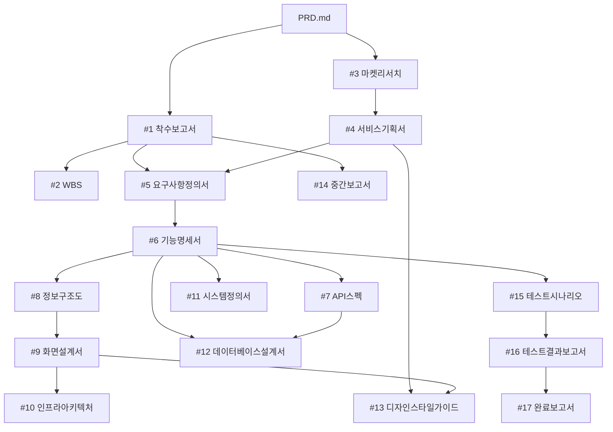

# Document Chain kbt 소급 반영 스킬 (docs-cascade-kbt)

시스템/화면 UI가 변경된 뒤 "이 변경을 산출물에도 반영해줘"라는 요청을 받았을 때, 어떤
산출물을, 어떤 범위로, 어떤 형식으로 갱신할지 매번 새로 판단하지 않도록 표준화한 절차입니다.
2026-08-08 세션에서 실제로 실행한 절차(SCR-003/DASH-AUTO UI 변경 → 화면설계서 → 정보구조도·
기능명세서 → 그 하위 전체 산출물)를 일반화했습니다.

## 핵심 원칙 (반드시 지킬 것)

1. **공식 산출물 원본은 수정하지 않는다.** `.progress.md`(Gate-Check 추적기)도 수정하지
   않는다. 사용자가 명시적으로 "정식 라인으로 승격해줘/합쳐줘"라고 하지 않는 한, 모든 결과물은
   `<원본파일명>_kbt.md` 신규 파일로만 만든다.
2. **신규 F-ID/I-F-ID/DB테이블을 함부로 만들지 않는다.** UI/화면 변경이 기존 기능의 표현
   방식만 바꾼 것인지, 진짜 새 기능/연동/데이터가 필요한지 먼저 판단한다. 대부분의 UI 리팩터링
   (레이아웃 재배치, 표기 형식 변경, 재사용 대시보드 추가)은 **기존 F-ID의 재사용**으로 처리하고,
   문서에는 "신규 OOO 없음"을 명시적으로 적는다. 진짜 새 기능이면 사용자에게 새 F-ID 채번이
   맞는지 확인한다.
3. **영향 범위는 추측하지 말고 DAG로 산정한다.** 아래 "Document Chain 의존관계" 표를 그대로
   사용한다. 범위를 임의로 넓히거나(불필요한 문서까지 손대서 불일치 위험 키움) 좁히지(사용자가
   지정한 상위 소급 반영을 누락) 않는다.
4. **변경이 없는 영향권 문서도 빠뜨리지 않는다.** 실질적으로 내용이 안 바뀌는 문서(예: 순수
   UI 변경일 때 데이터베이스설계서, 인프라아키텍처)도 `_kbt.md`를 만들고 헤더에 "변경 없음
   확인"을 명시한다 — 이렇게 해야 "어느 문서를 검토했는지"가 산출물 세트만 보고 추적된다.
5. **모든 변경은 근거를 남긴다.** `05.리포트/변경이력_kbt.md`에 이번 라운드의 변경 배경·순서·
   파일별 변경 요약을 추가한다(파일이 이미 있으면 새 절로 append, 새로 만드는 게 아니면).

## Document Chain 의존관계 (CLAUDE.md 기준, 그대로 사용)



| 파일 | 직접 의존(상위) | 직접 피의존(하위) |
|---|---|---|
| 02.기획문서/화면설계서.md (#9) | #8 정보구조도, #6 기능명세서(간접) | #10 인프라아키텍처, #13 디자인스타일가이드 |
| 02.기획문서/정보구조도.md (#8) | #6 기능명세서 | #9 화면설계서 |
| 02.기획문서/기능명세서.md (#6) | #5 요구사항정의서 | #7 API스펙, #8 정보구조도, #11 시스템정의서, #15 테스트시나리오 |
| 02.기획문서/API스펙.md (#7) | #6 기능명세서 | #12 데이터베이스설계서 |
| 03.구현문서/시스템정의서.md (#11) | #6 기능명세서 | (없음) |
| 03.구현문서/데이터베이스설계서.md (#12) | #6, #7 | (없음) |
| 03.구현문서/인프라아키텍처.md (#10) | #9 화면설계서 | (없음) |
| 03.구현문서/디자인스타일가이드.md (#13) | #4 서비스기획서, #9 화면설계서 | (없음) |
| 04.검수문서/테스트시나리오.md (#15) | #6 기능명세서 | #16 테스트결과보고서(코드/테스트 존재 시에만) |

## 절차

### Step 0. 변경 내용 파악
- 사용자가 변경 내용을 설명했다면 그대로 근거로 삼는다. 불명확하면 `git diff` / `git status`로
  `src/frontend`(또는 해당 구현 코드) 변경분을 직접 확인한다.
- 변경 성격을 분류한다: **(a) 순수 UI/표기 변경** (레이아웃, 라벨, 표 형식 등 — 기능 불변),
  **(b) 신규 화면 추가**(기존 데이터 재사용, 신규 기능 없음), **(c) 진짜 신규 기능/연동/데이터**
  (신규 F-ID/I-F-ID/DB 테이블이 필요할 수 있음). (c)인 경우 새 ID 채번이 맞는지 먼저 사용자에게
  확인한다(질문 1개로 충분, AskUserQuestion 사용 가능).

### Step 1. 시작점(root) 산출물 결정
- 화면 UI/레이아웃 변경 → `#9 화면설계서.md`가 root.
- 순수 기능 로직 변경(화면 없음) → `#6 기능명세서.md`가 root.
- 인프라/배포 변경 → `#10 인프라아키텍처.md`가 root.
- root 산출물의 `_kbt.md`가 이미 있으면 **새로 만들지 말고 이어서 갱신**한다(아래 "재실행 시"
  참고).

### Step 2. 영향 범위 산정
- 위 DAG 표에서 root의 **하위(피의존)** 산출물을 전부 후보에 넣는다.
- root 변경이 상위 문서의 전제(정보구조·기능 목록)에도 영향을 준다면(예: 화면 자체가 기존
  기능명세서/정보구조도에 없던 개념이었다면) **상위로도 소급**한다 — 2026-08-08 세션처럼
  화면설계서 변경이 정보구조도·기능명세서까지 거슬러 올라간 경우가 그 예다. 애매하면
  AskUserQuestion으로 범위(다운스트림만 vs 업스트림까지 포함)를 1회 확인한다.
- 범위가 넓어질수록(예: #6까지 거슬러 올라가면) #6의 다른 모든 하위 문서도 자동으로 후보에
  포함된다(표 참고).

### Step 3. 문서별 갱신
각 대상 파일에 대해:
1. `cp <원본>.md <원본>_kbt.md` (원본이 없으면 스킵하고 사용자에게 알림)
2. 헤더에 아래 고지문 블록을 추가(제목에 `(kbt)` 접미사, 최종 갱신일, 버전은 `v1.(N+1)-kbt`
   형식으로 증가):
   ```
   > 본 문서는 공식 산출물 `<원본>.md`(<원본 작성일> 확정)를 훼손하지 않는 별도 검토
   > 브랜치입니다. Gate-Check/`.progress.md` 추적 대상이 아닙니다.
   >
   > **kbt 변경 이력(<오늘 날짜>)**: <이번 변경 요약 1~3문장, 신규 F-ID/I-F/DB 여부 명시>
   ```
3. **실질 변경이 있는 절만** 정밀 수정한다(표, ASCII 레이아웃, 컴포넌트 목록 등) — 문서
   전체를 재작성하지 않는다. 변경이 없는 절은 그대로 둔다.
4. 실질 변경이 없는 문서는 3을 생략하고 헤더 고지문에 "신규 OOO 없음 / 변경 없음 확인"만
   명시한다(데이터베이스설계서·인프라아키텍처가 전형적인 예).
5. 문서 하단 "참고 문서" 목록과 "작성 완료 여부" 줄을 갱신한다 — 상호 참조는 전부 `_kbt.md`
   버전으로 링크하고, `05.리포트/변경이력_kbt.md`를 참고 문서에 추가한다.

### Step 4. 근거 자료 갱신
- `05.리포트/변경이력_kbt.md`가 없으면 새로 만들고, 있으면 새 날짜 섹션을 append한다.
- 포함할 내용: 변경 배경/순서 표, 코드 레벨 변경 요약(파일·함수 단위), 문서별 변경 요약 표,
  DAG 기반 범위 산정 mermaid 다이어그램, 원본 소스(디자인 소스 URL, PDF명, 사용자 요청 등).

### Step 5. UI 스크린샷이 필요한 경우 (선택)
- 화면 캡처 기반 산출물(`05.리포트/화면설계서_사용자파트_kbt.html` 등)도 갱신 대상이면
  `sb-creator-kbt` 스킬을 호출해 재생성한다(로컬 서버 기동 → Playwright 캡처 → 빌드 →
  PPTX 인젝션 → 검증 순서는 해당 스킬 문서를 그대로 따른다).

### Step 6. 검증
- 각 `_kbt.md` 파일의 마크다운 코드펜스(` ``` `) 개수가 짝수인지 확인(`grep -c '```' file`).
- 변경 요약을 사용자에게 표로 보고한다(파일별 1줄 요약).

## 재실행 시 (이미 kbt 브랜치가 존재하는 상태에서 추가 변경 반영)
- 기존 `_kbt.md`를 원본처럼 다시 `cp`하지 않는다 — **기존 `_kbt.md`를 직접 Edit**해서 이어
  갱신한다.
- 버전 번호를 `v1.1-kbt` → `v1.2-kbt`처럼 증가시키고, 헤더의 "kbt 변경 이력" 블록에 새 날짜
  항목을 추가(기존 이력은 지우지 않고 아래에 누적).
- `05.리포트/변경이력_kbt.md`도 덮어쓰지 말고 새 날짜 섹션을 append.

## 승격(공식 반영)이 필요할 때
- 사용자가 "이제 정식으로 반영해줘"라고 명시하면: `_kbt.md` 내용에서 kbt 고지문·버전 표기만
  제거하고 원본 파일에 덮어쓴 뒤, `.progress.md`의 해당 행 상태/완료일을 갱신하고 Gate-Check
  3단계(상태 완료 처리 → NotebookLM 소스 등록 → 실패 시 `[NLM 미등록]` 기록)를 CLAUDE.md
  규칙대로 수행한다. 이 승격 작업은 이 스킬의 기본 동작이 아니며, 명시적 요청이 있을 때만
  수행한다.
