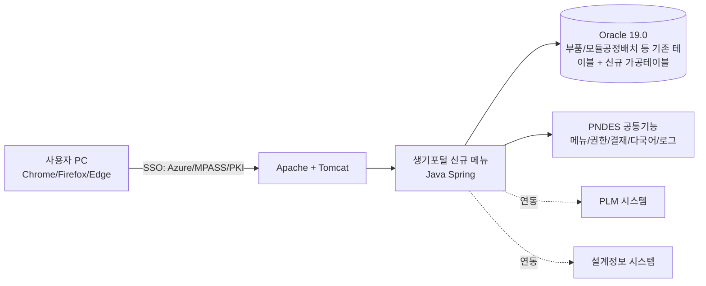

# PNDES 인프라 구성 (현재 기준 정리)

> 이 문서는 `PRD.md`에 명시된 정보만을 기준으로 작성했습니다. 실제 서버 사양, IP, 접근 경로 등 세부 정보는 아직 확정되지 않았으며, 확인되는 대로 갱신이 필요합니다(하단 "미확정 항목" 참고).
> 작성일: 2026-08-07

---

## 1. 개요

본 프로젝트는 신규 인프라를 구축하는 것이 아니라, 현대모비스 생산기술포털(PNDES)의 **기존 온프레미스 인프라 위에 신규 메뉴 2건을 증설**하는 구조다. AP-Framework V0.43의 기본 인프라 가정(Vercel/Supabase 등 클라우드 배포)은 적용되지 않는다.

## 2. 기술 스택 (PRD.md 기준)

| 영역 | 기술 |
|---|---|
| Frontend | JQuery + HTML5 |
| Backend | Java Spring |
| DBMS | Oracle 19.0 |
| OS | Redhat Linux 8.10 |
| Middleware | Apache / Tomcat |
| 인증/SSO | Azure, MPASS, PKI 인증 |
| 지원 브라우저 | Chrome, Firefox, MS Edge (HTML5) |

## 3. 개념적 구성도 (PRD 기준으로 추정 가능한 범위)

> 위 다이어그램은 PRD.md에 기재된 기술 스택과 연동 대상만을 근거로 구성한 개념도이며, 실제 네트워크 구성/서버 대수/방화벽 정책 등은 반영되어 있지 않다.

## 4. 데이터 연동 대상 (PRD.md 기준)

| 연동 대상 | 연동 목적 |
|---|---|
| 부품공정배치 / 모듈공정배치 (기존 PNDES 데이터) | 자동화 현황 신규 메뉴가 재사용하는 원천 데이터 |
| PLM 시스템 | 생기포털 시스템 연계시스템 (PRD 참고문서 기준, 상세 연동 항목은 RFP 원문 확인 필요) |
| 설계정보 시스템 | 생기포털 시스템 연계시스템 |

## 5. 개발/운영 환경 구분

| 구분 | 내용 | 확정 여부 |
|---|---|---|
| 개발/테스트 서버 | RFP 기준 별도 제공 예정 | 미확정 (`.AP-key.md` §7 참고) |
| 운영 서버 | Oracle 19.0 / Redhat Linux 8.10 / Apache-Tomcat | 스펙(사양)만 확정, 실 서버 정보 미확정 |
| 프로젝트 수행 장소 | 의왕연구소 협력개발동 (변경 가능성 있음) | PRD/RFP 참고사항 기준 |

## 6. 미확정 항목 (현재 PRD.md만으로는 알 수 없는 정보)

아래 항목은 현재 PRD.md에 근거가 없어 임의로 작성하지 않았습니다. 확인되는 대로 이 문서를 갱신하세요.

- 실제 서버 IP/호스트명, 방화벽/네트워크 구성도
- Oracle 19.0 인스턴스명, 스키마 구조, DB 접속 정보
- 개발/스테이징/운영 서버 대수 및 이중화 여부
- 배포 파이프라인(수동 배포 절차, 배포 담당 조직)
- PLM/설계정보 시스템과의 정확한 인터페이스 방식(EAI vs ETL, 배치 주기 등)

## 7. 참고 문서

- `PRD.md` § 프로젝트 개요(기술 스택), 부록 C(자동화 현황 데이터/연동 요건), 부록 J(비기능 요구사항 상세)
- `CLAUDE.md` § Tech Stack — ⚠️ 프로젝트 커스텀
- `.AP-key.md` § 7. 배포 — PNDES 온프레미스
