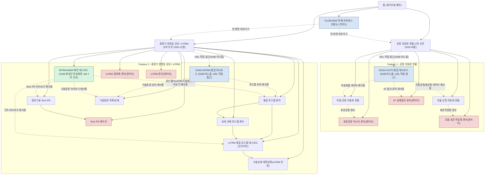
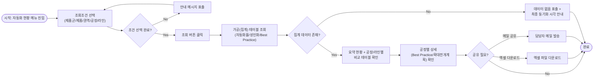
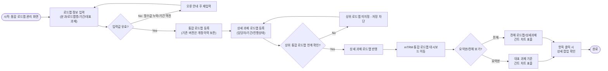
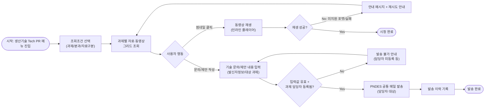

# 정보구조도 (Information Architecture) (kbt)

**프로젝트명**: PLM 생기포털 고도화 — 공정 자동화 현황 및 중장기 방향성 공유 신규 기능 구축
**작성일**: 2026-08-07
**최종 갱신일**: 2026-08-08 (kbt 검토 브랜치, 2차 갱신)
**버전**: v1.2-kbt
**근거 문서**: `02.기획문서/기능명세서_kbt.md` (F-001~F-019), `02.기획문서/화면설계서_kbt.md`(FLOW-MAP·DASH-AUTO·DASH-MTRM·MTRM-MAIN 포함 총 18개 화면)

> 본 문서는 공식 산출물 `정보구조도.md`(2026-08-07 확정)를 훼손하지 않는 별도 검토 브랜치입니다. Gate-Check/`.progress.md` 추적 대상이 아닙니다.
>
> **kbt 변경 이력(2026-08-08, 1차)**: `화면설계서_kbt.md`에 신규 반영된 3개 화면(FLOW-MAP, DASH-AUTO, DASH-MTRM)을 사이트맵·화면-기능 매핑·접근권한 표에 소급 반영. 이 3개 화면은 신규 기능(F-ID)을 추가하지 않고, 기존 화면(SCR-001~014)의 데이터를 조회/재사용하는 내비게이션 허브 + 요약 대시보드 역할로 서술했었습니다.
>
> **kbt 변경 이력(2026-08-08, 2차 — 1차 서술 정정 + MTRM-MAIN 추가, 신규 F-ID 없음)**: `src/frontend` 최종 GNB 확정본(`design_handoff_pndes_portal/README.md` 기준) 대조 결과, **DASH-AUTO/DASH-MTRM은 실제로는 좌측 GNB 메뉴에 노출되지 않는 URL 직접 접근용 대시보드**였음을 확인하여 1차의 "내비게이션 허브" 서술을 정정합니다. 대신 중장기 방향성 공유 그룹에는 **MTRM-MAIN(메인 대시보드)**이 신규로 GNB 최상단 진입화면 역할을 수행합니다(화면설계서_kbt.md 2절 참고). 아울러 "1차/2차 오픈 시 DASH-AUTO/DASH-MTRM 메뉴 노출"·"대시보드 우선 진입" 서술(6장)도 함께 정정합니다.

> 본 문서는 생기포털(PNDES) 메인 홈 하위에 신규로 증설되는 2개 메뉴(① 공정 자동화 현황, ② 중장기 방향성 공유/mTRM)의 정보구조를 정의합니다. 신규 웹서비스가 아닌 기존 전사 시스템 내 메뉴 추가이므로, 홈(생기포털 메인)은 기존 메뉴 구조를 유지하고 하위에 두 메뉴 트리만 추가됩니다.

---

## 1. 전체 사이트맵

> 붉은색(admin 스타일)으로 표시된 화면은 관리자 전용 화면입니다. 그 외 화면은 전체 사용자가 조회 가능하며, 화면 내 등록/수정 기능은 화면-기능 매핑 표(3장) 및 권한 구분 표(4장)의 기준을 따릅니다. **파란색(dash 스타일)**은 신규 기능(F-ID) 없이 기존 화면 데이터를 재사용하는 대시보드이나 **좌측 GNB에는 노출되지 않고 URL로만 접근**하는 화면입니다(FLOW-MAP은 `?showFlowMap=1` 파라미터로만 임시 노출, DASH-AUTO/DASH-MTRM는 상시 URL 접근용). **초록색(gnbdash 스타일, kbt 2차 추가)**은 동일하게 신규 기능 없이 기존 데이터를 재사용하지만 **좌측 GNB에 실제로 노출되는 진입화면**(MTRM-MAIN)입니다. 이 구분은 1차 문서의 "내비게이션 허브" 서술을 정정한 것입니다.

---

## 2. 사용자 흐름 (User Flow)

### 2.1 부품/모듈 공정 자동화 현황 조회 흐름 (F-001, F-005)

### 2.2 mTRM 통합 로드맵 등록 및 간트차트 확인 흐름 (F-010~F-012)

### 2.3 Tech PR 자료 조회 및 기술 문의 메일 발송 흐름 (F-013, F-014)

---

## 3. 화면-기능 매핑 표

| 화면명 | 화면ID | 주요 기능 | 관련 기능ID |
|---|---|---|---|
| 전체 프로세스 흐름도 (kbt) | FLOW-MAP | 전체 화면(FLOW-MAP 포함 17개) 흐름 시각화 및 바로가기 내비게이션 | 전체 F-ID(공통, 신규 기능 없음) |
| 공정 자동화 현황 통합 대시보드 (kbt, GNB 미노출·URL 직접 접근) | DASH-AUTO | SCR-001·SCR-003·SCR-005 요약 데이터 재사용 표출, 중장기 확대 전개 로드맵 요약 | F-001, F-005, F-009 (재사용, 신규 기능 없음) |
| 부품 공정 자동화 현황 화면 | SCR-001 | 조건별 조회, 공장/라인 비교, 공정별 상세 등록/수정 | F-001, F-002 |
| 표준공정 마스터 관리 화면 | SCR-002 | 표준공정 마스터 등록/수정, 조회 및 엑셀 다운로드 | F-003, F-004 |
| 모듈 공정 자동화 현황 화면 | SCR-003 | 공장별 모듈 자동화 현황 조회, 연동 데이터 반영 표출, 표준 작업명 선택 표출 | F-005, F-006, F-008 |
| 모듈 표준 작업명 관리 화면 | SCR-004 | 모듈 표준 작업명 등록/삭제 | F-007 |
| I/F 실행결과 관리 화면 | SCR-005 | 모듈공정배치 I/F(배치) 실행 결과·연동 이력 조회 | F-009 |
| 메인 대시보드 (kbt 2차 신규, GNB 최상단 진입화면) | MTRM-MAIN | 통합 로드맵 미니간트·생산기술 Tech PR·최근 기술동향 요약 데이터 재사용 표출 | F-010, F-011, F-013, F-019 (재사용, 신규 기능 없음) |
| 중장기 방향성 공유 통합 대시보드 (kbt, GNB 미노출·URL 직접 접근) | DASH-MTRM | SCR-010·SCR-011·SCR-016A·SCR-019 요약 데이터 재사용 표출 | F-010, F-011, F-016, F-019 (재사용, 신규 기능 없음) |
| 통합 로드맵 관리 화면 | SCR-006 | 분과별 통합 로드맵 등록/조회, 개정이력 관리 (하위 SCR-007/008 GNB 서브메뉴) | F-010 |
| 상세 과제 로드맵 관리 화면 | SCR-007 | 상세 과제 로드맵 등록/조회 | F-011 |
| mTRM 통합 로드맵 대시보드 | SCR-008 | 전체/요약본 간트 차트 조회, 항목별 상세 팝업 | F-012 |
| 생산기술 Tech PR 화면 | SCR-009 | 과제별 자료·동영상 그리드 조회/재생, 기술 문의/제안 메일 발송 | F-013, F-014 |
| Tech PR 관리자 화면 | SCR-010 | 과제별 자료·동영상 등록(관리자) | F-015 |
| mTRM 협의체 관리 화면 | SCR-011 | 협의체 등록/조회, 분과장 메일 발송 | F-016 |
| mTRM 관리 화면 | SCR-012 | mTRM 항목 조회/등록/수정/삭제 | F-017 |
| 기술과제 계획등록 화면(mTRM 연동 영역) | SCR-013 | 기술과제 계획 등록 시 mTRM 로드맵 자동 매핑 | F-018 |
| 기술동향 목록/상세 화면 | SCR-014 | 기술동향 카드형 목록 등록/조회, 상세 View, 이전/다음 이동 | F-019 |

> F-001~F-019 총 19개 기능이 SCR-001~SCR-014 총 14개 화면에 빠짐없이 매핑되었습니다(일부 화면은 복수 기능을 포함). **(kbt)** FLOW-MAP·DASH-AUTO·DASH-MTRM·MTRM-MAIN 4개 화면은 신규 F-ID를 추가하지 않고 기존 화면의 조회 결과를 재사용/집계 표출만 하므로, 총 18개 화면 기준으로도 F-001~F-019 매핑 커버리지는 변동 없습니다.

---

## 4. 내비게이션/권한 구분

### 4.1 화면별 접근 권한

| 화면ID | 화면명 | 일반 사용자 | 생기 업무 담당자 | 생기기획팀(관리자) | 비고 |
|---|---|---|---|---|---|
| FLOW-MAP | 전체 프로세스 흐름도 (kbt) | 조회 | 조회 | 조회 | 내비게이션 전용, 등록/수정 기능 없음 |
| DASH-AUTO | 공정 자동화 현황 통합 대시보드 (kbt) | 조회 | 조회 | 조회 | SCR-001/003/005 데이터 재사용, 별도 등록/수정 없음. **GNB 미노출, URL 직접 접근** |
| SCR-001 | 부품 공정 자동화 현황 화면 | 조회 | 조회/등록/수정(F-002) | 조회/등록/수정 | 등록/수정은 팝업으로 제공 |
| SCR-002 | 표준공정 마스터 관리 화면 | 조회/다운로드 | 조회/다운로드 | 조회/등록/수정 | 등록/수정(F-003)은 관리자 전용 |
| SCR-003 | 모듈 공정 자동화 현황 화면 | 조회 | 조회 | 조회 | 데이터 반영(F-006)은 시스템(배치) 처리 |
| SCR-004 | 모듈 표준 작업명 관리 화면 | 접근 불가 | 접근 불가 | 조회/등록/삭제 | 관리자 전용 화면 |
| SCR-005 | I/F 실행결과 관리 화면 | 접근 불가 | 접근 불가 | 조회 | 관리자 전용, 실행은 시스템(배치) |
| MTRM-MAIN | 메인 대시보드 (kbt 2차 신규) | 조회 | 조회 | 조회 | F-010/011/013/019 데이터 재사용, 별도 등록/수정 없음. **GNB 최상단 진입화면** |
| DASH-MTRM | 중장기 방향성 공유 통합 대시보드 (kbt) | 조회 | 조회 | 조회 | SCR-010/011/016A/019 데이터 재사용, 별도 등록/수정 없음. **GNB 미노출, URL 직접 접근** |
| SCR-006 | 통합 로드맵 관리 화면 | 조회 | 조회/등록/수정 | 조회/등록/수정 | 하위 SCR-007/008 GNB 서브메뉴(접기/펼치기) |
| SCR-007 | 상세 과제 로드맵 관리 화면 | 조회 | 조회/등록/수정 | 조회/등록/수정 | |
| SCR-008 | mTRM 통합 로드맵 대시보드 | 조회 | 조회 | 조회 | 전체 사용자 조회 가능 |
| SCR-009 | 생산기술 Tech PR 화면 | 조회/재생/문의발송 | 조회/재생/문의발송 | 조회/재생/문의발송 | 전체 사용자 대상 |
| SCR-010 | Tech PR 관리자 화면 | 접근 불가 | 접근 불가 | 등록/조회 | 관리자 전용 화면 |
| SCR-011 | mTRM 협의체 관리 화면 | 접근 불가 | 접근 불가 | 등록/조회 | 관리자 전용 화면 |
| SCR-012 | mTRM 관리 화면 | 조회만 | 조회만 | 조회/등록/수정/삭제 | CRUD는 관리자 전용 |
| SCR-013 | 기술과제 계획등록 화면(mTRM 연동 영역) | 접근 불가 | 등록 | 등록 | 경영진/과제 관리자 포함 |
| SCR-014 | 기술동향 목록/상세 화면 | 조회 | 조회 | 등록/조회 | 등록은 생기기획팀 전용 |

### 4.2 내비게이션 원칙

| 구분 | 원칙 |
|---|---|
| 메뉴 노출 | 생기포털 홈 메뉴 트리에는 전체 사용자 대상 화면만 기본 노출(SCR-001, 002, 003, 006~009, 012(조회), 014, **MTRM-MAIN**). **DASH-AUTO/DASH-MTRM은 메뉴 트리에 노출되지 않음(kbt 2차 정정, 아래 참고)** |
| 관리자 화면 진입 경로 | 관리자 전용 화면(SCR-004, 005, 010, 011, 및 SCR-002/003/012/013/014 등록·CRUD 기능)은 별도 관리자 메뉴 그룹 또는 일반 화면 내 관리 버튼(권한 체크 통과 시 노출)으로 진입 |
| 권한 체크 시점 | 메뉴 클릭 시 및 화면 내 등록/수정/삭제 액션 클릭 시 PNDES 공통 권한관리 로직(NFR-002)으로 이중 체크 |
| 미인증 사용자 | Azure/MPASS/PKI 기반 SSO 미인증 시 전체 화면 접근 차단(NFR-005) |
| 1차/2차 오픈 구분 | 1차 오픈(2026-09말) 시 SCR-001~005 메뉴 노출(DASH-AUTO는 GNB 미노출·URL 직접 접근), 2차 오픈(2026-12말) 시 SCR-006~014 + **MTRM-MAIN** 메뉴 노출(DASH-MTRM은 동일하게 GNB 미노출·URL 직접 접근) — **(kbt 2차 정정)** 1차본의 "DASH-AUTO/DASH-MTRM 메뉴 노출" 서술을 정정 |
| 가이드 화면 노출(kbt) | FLOW-MAP은 기본적으로 GNB에 노출하지 않으며, 화면설계서 캡처 등 필요 시에만 `?showFlowMap=1` 쿼리스트링으로 해당 세션에서 임시 노출(kbt 2차 정정 — 1차본은 "상시 노출"로 서술했었음) |
| 초기 랜딩 화면(kbt 2차 정정) | 로컬 프로토타입(`src/frontend`) 기준 최초 진입 화면은 **SCR-001**(부품 공정 자동화 현황)이며, 중장기 방향성 공유 그룹의 GNB 최상단 진입화면은 **MTRM-MAIN**입니다. DASH-AUTO/DASH-MTRM는 랜딩 화면이 아닙니다(1차본 "대시보드 우선 진입" 서술 정정). 실 운영 환경의 최초 진입 화면 정책은 착수보고서/서비스기획서 결정 사항을 별도 확인 필요 |

---

**작성 완료 여부**: [x] 정보구조도 작성 완료(v1.0 공식) / [x] kbt 1차 반영 완료(FLOW-MAP·DASH-AUTO·DASH-MTRM 3개 화면 소급 반영) / [x] kbt 2차 반영 완료(MTRM-MAIN 신규 반영, GNB 노출 범위·초기 랜딩화면 서술 정정)

**승인**:
- [ ] 정보구조도 승인 (User Sign-off)

## 참고 문서

- `02.기획문서/기능명세서_kbt.md` (F-001~F-019 및 관련 화면 근거)
- `02.기획문서/요구사항정의서.md` (REQ-001~012)
- `02.기획문서/화면설계서_kbt.md` (FLOW-MAP·DASH-AUTO·DASH-MTRM·MTRM-MAIN 포함 총 18개 화면 상세)
- `design_handoff_pndes_portal/README.md` (좌측 GNB 최종 구조 근거, kbt 2차)
- `PRD.md` (부록 C — Feature 1 상세, 부록 D — Feature 2 상세)
- `05.리포트/변경이력_kbt.md` (kbt 브랜치 전체 변경 근거 자료)
