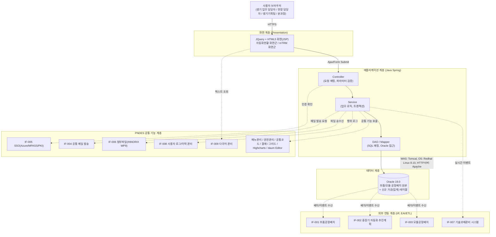

# 시스템 정의서 (kbt)

**프로젝트명**: PLM 생기포털 고도화 — 공정 자동화 현황 및 중장기 방향성 공유 신규 기능 구축
**작성일**: 2026-08-07
**최종 갱신일**: 2026-08-08 (kbt 검토 브랜치, 2차 갱신)
**버전**: v1.2-kbt
**근거 문서**: `02.기획문서/기능명세서_kbt.md`(F-001~F-019), `02.기획문서/API스펙_kbt.md`(I/F설계서, IF-001~IF-009), `02.기획문서/화면설계서_kbt.md`

> 본 문서는 공식 산출물 `시스템정의서.md`(2026-08-07 확정)를 훼손하지 않는 별도 검토 브랜치입니다. Gate-Check/`.progress.md` 추적 대상이 아닙니다.
>
> **kbt 변경 이력(2026-08-08, 1차)**: FLOW-MAP·DASH-AUTO·DASH-MTRM 화면 신규 반영에 따라 **신규 대시보드 모듈**(3절 참고)을 추가했습니다. 신규 DB 테이블·신규 I/F는 없으며, 기존 모듈(자동화현황-부품공정/모듈공정, mTRM-로드맵/TechPR/협의체/기술동향)의 Service 조회 결과를 조합·재사용하는 조회 전용(read-only) 조립 계층입니다.
>
> **kbt 변경 이력(2026-08-08, 2차 — 변경 없음 확인)**: MTRM-MAIN은 1차에서 추가한 **대시보드 모듈**(`dashboard` 패키지)을 그대로 재사용하는 화면으로, 신규 모듈·신규 DB·신규 I/F가 없습니다. GNB 구성 정정, SCR-012/014 등록 모달은 프론트엔드 화면 변경 범위로 시스템 구성에 영향이 없습니다.

> 시스템의 기술 스택, 모듈 구성, 인터페이스 규약을 정의한다. 본 프로젝트는 신규 웹서비스가 아닌 현대모비스 생산기술포털(PNDES) 기존 시스템에 신규 메뉴를 증설하는 SI 프로젝트이므로, 아래 내용은 CLAUDE.md에 정의된 **PNDES 고객사 표준**을 기준으로 작성했습니다.

---

## 1. 기술 스택

> **주의**: 아래 표는 AP-Framework V0.43 기본 스택(`Next.js + Tailwind CSS / Express.js / PostgreSQL / Vercel`)이 아닙니다. 본 프로젝트는 PNDES 기존 시스템 증설이므로 고객사(현대모비스/현대오토에버) 표준 스택을 그대로 따릅니다.

| 영역 | 기술 | 버전 | 비고 |
|------|------|------|------|
| Frontend | **JQuery + HTML5** | JQuery 3.x | PNDES 공통 UI 표준, JSP 기반 화면 퍼블리싱, 화면 퍼블리싱은 고객사 지원 인력과 협업 |
| Backend | **Java Spring** | Spring Framework(PNDES 표준 버전) | PNDES 개발표준, IntelliJ 사용 |
| Database | **Oracle** | 19.0 | 기존 부품/모듈 공정배치 테이블 재사용 + 신규 가공(집계) 테이블 |
| OS/WAS | **Redhat Linux / Apache·Tomcat** | Redhat 8.10 | 온프레미스 |
| 인증/SSO | Azure, MPASS, PKI | PNDES 표준 | IF-005 연계 |
| 배포 | 온프레미스(고객사 지정 환경) | - | Vercel/Supabase 미사용, 별도 CI/CD(고객사 운영 프로세스) |
| CI/CD | GitHub Actions | - | 문서/형상관리 보조 용도로만 사용, 실제 배포는 고객사 프로세스 따름 |
| 공통기능 | PNDES 공통 기능 | - | 메뉴관리, 권한관리, 공통코드, 다국어관리, 번역, 결재, 파일업다운로드(INNORIX WP9), 그리드, 차트(Highcharts), 웹에디터(daum Editor) |

---

## 2. 시스템 구성도



- 사용자는 PNDES SSO(Azure/MPASS/PKI, IF-005) 인증을 통과해야 화면(JSP)에 접근할 수 있습니다.
- 화면(JQuery+HTML5)은 Ajax/Form 방식으로 Java Spring Controller를 호출하며, Controller → Service → DAO 계층을 거쳐 Oracle 19.0에 접근합니다.
- 외부 원본 시스템(부품공정배치, 중장기 자동화 추진계획, 모듈공정배치, 기술과제관리)과의 데이터 연동은 IF-001~IF-003, IF-007을 통해 처리되며, 결과는 가공(집계) 테이블에 반영됩니다.
- 인증/메일/파일/로그/다국어 등 횡단 기능은 PNDES 공통 기능 계층(IF-004~IF-006, IF-008, IF-009)을 통해 처리됩니다.

---

## 3. 모듈/패키지 구성

| 모듈명 | 역할 | 포함 기능ID | 의존 모듈 |
|---|---|---|---|
| 자동화현황-부품공정 모듈 | 부품 공정 자동화 현황 조회/등록, Best Practice·성인화 집계 표출 | F-001, F-002 | 공통 모듈(인증/파일/로그), I/F연동 모듈(IF-001, IF-002) |
| 자동화현황-모듈공정 모듈 | 모듈 공정 자동화 현황 조회, 모듈공정배치 연동 반영 | F-005, F-006 | I/F연동 모듈(IF-003), 표준마스터 모듈 |
| 표준마스터 모듈 | 표준공정 마스터 등록/수정/조회/엑셀다운로드 | F-003, F-004 | 공통 모듈(로그) |
| 표준작업명 모듈 | 모듈 표준 작업명 등록/삭제/연동 표출 | F-007, F-008 | 자동화현황-모듈공정 모듈 |
| I/F연동 모듈 | 부품/모듈공정배치 등 외부 원본 데이터 배치·이벤트 수신, 실행 결과 관리 | F-009 | Oracle 가공 테이블, 공통 모듈(로그) |
| mTRM-로드맵 모듈 | 통합 로드맵/상세 과제 로드맵 등록·조회, 간트 차트 조회 | F-010, F-011, F-012 | 공통 모듈(차트-Highcharts) |
| mTRM-TechPR 모듈 | Tech PR 자료·동영상 그리드 조회/재생, 기술 문의/제안 메일 발송, 자료 등록(관리자) | F-013, F-014, F-015 | 공통 모듈(파일-INNORIX WP9, 메일, 로그) |
| mTRM-협의체 모듈 | mTRM 협의체 등록 및 분과장 메일 발송 | F-016 | 공통 모듈(메일, 로그) |
| mTRM-관리 모듈 | mTRM 항목 CRUD 관리 | F-017 | mTRM-로드맵 모듈 |
| mTRM-기술과제연동 모듈 | 기술과제 계획등록 시 mTRM 로드맵 자동 매핑 | F-018 | I/F연동 모듈(IF-007), mTRM-로드맵 모듈 |
| mTRM-기술동향 모듈 | 기술동향 카드형 목록 등록/조회 | F-019 | 공통 모듈(파일, 다국어) |
| 공통 모듈 | 인증/권한(SSO), 파일 업다운로드, 다국어, 사용자 로그 등 횡단 기능 제공 | (전체 F-ID 공통 적용) | IF-004, IF-005, IF-006, IF-008, IF-009 |
| **대시보드 모듈 (kbt 신규)** | FLOW-MAP(전체 화면 내비게이션), DASH-AUTO(자동화현황 요약), DASH-MTRM(mTRM 요약) 조회 전용 조립 계층 — 신규 DB 테이블/신규 업무 로직 없이 하위 모듈 Service 결과만 조합 | F-001, F-005, F-009, F-010, F-011, F-016, F-019(전체 조회 재사용) | 자동화현황-부품공정 모듈, 자동화현황-모듈공정 모듈, I/F연동 모듈, mTRM-로드맵 모듈, mTRM-협의체 모듈, mTRM-기술동향 모듈 |

> 자동화현황(F-001~F-009, 1차 오픈 2026.09월말)과 mTRM(F-010~F-019, 2차 오픈 2026.12월말)은 오픈 차수가 다르므로, 공통 모듈을 우선 개발하여 두 트랙에서 공유하는 것을 권장합니다. **(kbt)** 대시보드 모듈도 동일하게 DASH-AUTO는 1차, DASH-MTRM은 2차 오픈에 맞춰 단계 배포합니다.

---

## 4. 디렉토리 구조

> 본 저장소(`c:\Users\PLM`)의 `src/`는 **설계 검토·프로토타이핑 용도**이며, 실제 PNDES 소스는 고객사(현대오토에버) 형상관리 시스템에서 관리합니다. 아래 구조는 실제 Java Spring 패키지 구성을 설계 검토 목적으로 매핑한 예시입니다.

### 4.1 Java Spring 패키지 구조 (실 서버 기준, 설계 참고용)

```
com.mobis.pndes
├── automation                     # 자동화현황 모듈 (F-001~F-009)
│   ├── part                       # 부품 공정 (F-001, F-002)
│   │   ├── controller
│   │   ├── service
│   │   ├── dao
│   │   └── vo
│   ├── module                     # 모듈 공정 (F-005, F-006, F-007, F-008)
│   │   ├── controller
│   │   ├── service
│   │   ├── dao
│   │   └── vo
│   ├── standard                   # 표준공정 마스터 (F-003, F-004)
│   │   ├── controller
│   │   ├── service
│   │   ├── dao
│   │   └── vo
│   └── interfaceBatch             # I/F연동 배치/이벤트 처리 (F-009, IF-001~IF-003)
│       ├── job
│       ├── service
│       └── vo
├── mtrm                            # mTRM 모듈 (F-010~F-019)
│   ├── roadmap                    # 통합/상세 로드맵, 간트차트 (F-010~F-012)
│   │   ├── controller
│   │   ├── service
│   │   ├── dao
│   │   └── vo
│   ├── techpr                     # Tech PR 자료/메일/등록 (F-013~F-015)
│   │   ├── controller
│   │   ├── service
│   │   ├── dao
│   │   └── vo
│   ├── council                    # mTRM 협의체 (F-016)
│   │   ├── controller
│   │   ├── service
│   │   ├── dao
│   │   └── vo
│   ├── manage                     # mTRM 관리 CRUD (F-017)
│   │   ├── controller
│   │   ├── service
│   │   ├── dao
│   │   └── vo
│   ├── taskLink                   # 기술과제-mTRM 연동 (F-018, IF-007)
│   │   ├── controller
│   │   ├── service
│   │   └── vo
│   └── trend                      # 기술동향 (F-019)
│       ├── controller
│       ├── service
│       ├── dao
│       └── vo
├── dashboard                        # 대시보드 모듈 (kbt 신규 — FLOW-MAP, DASH-AUTO, DASH-MTRM)
│   ├── controller                  # 하위 모듈 Service 결과 조합 조회 API
│   ├── service                     # 조회 전용, 신규 DB 접근 없음(하위 Service 재호출)
│   └── vo
└── common                          # 공통 모듈
    ├── auth                        # SSO 인증/권한 (IF-005)
    ├── file                        # INNORIX WP9 연동 (IF-006)
    ├── mail                        # 공통 메일 발송 (IF-004)
    ├── i18n                        # 다국어 관리 (IF-009)
    ├── log                         # 사용자 로그/이력 (IF-008)
    └── exception                   # 공통 예외처리
```

### 4.2 본 저장소(`src/`) 매핑 (설계검토·프로토타이핑용)

| 저장소 경로 | 매핑 대상 | 용도 |
|---|---|---|
| `src/frontend/` | JSP/HTML/JQuery 화면 | 화면(F-001~F-019 관련 UI) 목업, 퍼블리싱 검토용 코드 |
| `src/backend/` | `com.mobis.pndes.*` 패키지 | Java Spring Controller/Service/DAO 의사코드 및 설계 검토용 목업 |
| `tests/` | 테스트 코드 | 테스트시나리오(#15) 기반 검증용 스크립트 |

> 실제 배포·형상관리는 고객사(현대오토에버) 운영 프로세스를 따르며, 본 저장소의 코드는 그대로 배포되지 않습니다.

---

## 5. 코딩 컨벤션

| 항목 | 규칙 |
|------|------|
| 패키지명 | 전체 소문자, 역도메인 표기 (`com.mobis.pndes.모듈명.하위모듈명`) |
| 클래스명 | 파스칼케이스(PascalCase), 계층 접미사 사용 (`AutomationPartController`, `AutomationPartService`, `AutomationPartDao`, `AutomationPartVo`) |
| 메서드/변수명 | 카멜케이스(camelCase) (`getAutomationRate`, `standardProcessList`) |
| 상수명 | 대문자 스네이크케이스 (`MAX_RETRY_COUNT`) |
| JSP 파일명 | 케밥케이스 또는 소문자 언더스코어, 모듈 접두어 포함 (`automation_part_list.jsp`, `mtrm-roadmap-gantt.jsp`) |
| JQuery 함수/변수 | 카멜케이스, 모듈 접두어 명확화 (`fnAutomationSearch()`, `fnMtrmRoadmapSave()`) |
| SQL Mapper(XML) ID | 스네이크케이스 또는 카멜케이스 통일, `select`/`insert`/`update`/`delete` 접두어 (`selectAutomationPartList`) |
| 들여쓰기 | 스페이스 4 (Java), 스페이스 2 (JSP/JQuery) |
| 주석 | Java Javadoc 스타일, 업무 로직 단위로 한글 주석 병기 권장 |
| 커밋 메시지 | 본 프로젝트 CLAUDE.md 규칙 준수 — `[주차] 산출물명 - 작업 내용` |

---

## 6. 에러 처리 규약

> PNDES는 HTTP 상태코드 기반 REST 응답 대신 **PNDES 공통 응답 포맷(resultCode/resultMsg/data)**을 사용합니다. HTTP 상태코드는 원칙적으로 200으로 고정하고, 실제 처리 성공/실패는 `resultCode`로 구분합니다.

### 6.1 공통 응답 포맷 (JSON)

```json
{
  "resultCode": "0000",
  "resultMsg": "정상 처리되었습니다.",
  "data": { }
}
```

실패 예시:

```json
{
  "resultCode": "9001",
  "resultMsg": "필수 입력값이 누락되었습니다.",
  "data": null
}
```

### 6.2 PNDES 공통 코드 체계 (예시)

| resultCode | 구분 | 의미 | 관련 사례 |
|---|---|---|---|
| 0000 | 성공 | 정상 처리 | 전체 조회/등록/수정/삭제 성공 |
| 9001 | 검증오류 | 필수값 누락, 입력 형식 오류 | F-002, F-003, F-010 저장 차단 |
| 9002 | 중복오류 | 중복 데이터 등록 시도 | F-003 표준공정명 중복, F-007 작업명 중복 |
| 9003 | 정합성오류 | 원본 데이터와 가공 테이블 불일치 | F-006, F-009, NFR-008 |
| 9004 | 권한오류 | 권한 없는 사용자의 등록/수정/삭제 요청 | F-002, F-003, F-007, F-015~F-017 |
| 9005 | 파일오류 | 허용 확장자 외 업로드, 용량 초과, 유해파일 탐지 | F-002, F-013~F-015, F-019, IF-006 |
| 9006 | 연동오류 | I/F(IF-001~IF-009) 연동 실패, 재시도 초과 | F-009, IF-001~IF-003, IF-004, IF-007 |
| 9007 | 메일발송오류 | 담당자/분과장 정보 미등록, 메일 발송 실패 | F-014, F-016, IF-004 |
| 9999 | 시스템오류 | 예기치 못한 서버 오류 | 전체 공통 |

### 6.3 처리 원칙

- Java Spring Controller에서는 공통 `ExceptionHandler`(`com.mobis.pndes.common.exception`)로 예외를 가로채어 위 공통 응답 포맷으로 변환합니다.
- I/F 연동 실패(IF-001~IF-009)는 최대 3회 재시도 후 지속 실패 시 담당자 알림 및 I/F 실행 이력 테이블에 기록합니다(NFR-007, API스펙.md 1장 공통 오류처리 정책과 동일).
- 정합성 불일치(NFR-008, F-006/F-009 관련)는 관리자 확인 큐에 등록하며, 자동 롤백하지 않고 관리자 승인 후 재처리합니다.
- 화면(JQuery)에서는 `resultCode`가 `0000`이 아닌 경우 `resultMsg`를 공통 알럿/토스트 컴포넌트로 표출합니다.

---

## 7. 연동 계층 개요 (I/F-001~IF-009 요약)

> 상세 내용은 `02.기획문서/API스펙.md`(I/F 설계서)를 근거 문서로 하며, 아래는 시스템정의서 관점에서 어느 모듈이 각 I/F를 호출/수신하는지 매핑한 요약입니다.

| I/F-ID | 연동구분 | 연동 대상 시스템 | 연동 방식 | 관련 기능ID | 시스템 내 담당 모듈 |
|---|---|---|---|---|---|
| IF-001 | 수신 | 부품공정배치 시스템 (PNDES 내) | ETL(배치, 1일 1회 야간) | F-001, F-002 | 자동화현황-부품공정 모듈, I/F연동 모듈 |
| IF-002 | 수신 | 중장기 자동화 추진계획 (PNDES 내) | ETL(배치, 1일 1회 야간) | F-001 | 자동화현황-부품공정 모듈, I/F연동 모듈 |
| IF-003 | 수신 | 모듈공정배치 시스템 (생기/생산, PNDES 내) | ETL(배치 1일 1회) + EAI(실시간 이벤트) | F-005, F-006, F-009 | 자동화현황-모듈공정 모듈, I/F연동 모듈 |
| IF-004 | 발신 | PNDES 공통 메일 발송 기능 | EAI(실시간 API 호출) | F-014, F-016 | mTRM-TechPR 모듈, mTRM-협의체 모듈, 공통 모듈(mail) |
| IF-005 | 수신/인증 | Azure / MPASS / PKI (SSO) | EAI(실시간) | 전체 F-ID(공통) | 공통 모듈(auth) — 전체 모듈 진입점에서 공유 |
| IF-006 | 송수신 | INNORIX WP9 (첨부파일 업/다운로드) | EAI(실시간) | F-002, F-013, F-014, F-015, F-019 | 자동화현황-부품공정 모듈, mTRM-TechPR 모듈, mTRM-기술동향 모듈, 공통 모듈(file) |
| IF-007 | 수신(이벤트) | 기술과제관리 시스템 (PNDES 내) | EAI(실시간 이벤트) | F-018 | mTRM-기술과제연동 모듈 |
| IF-008 | 발신 | PNDES 공통 사용자 로그/이력 관리 | EAI(실시간) | F-004, F-014, F-016 | 표준마스터 모듈, mTRM-TechPR 모듈, mTRM-협의체 모듈, 공통 모듈(log) |
| IF-009 | 수신 | PNDES 공통 다국어 관리 | EAI(실시간 조회, 캐시 권장) | 전체 F-ID(공통) | 공통 모듈(i18n) — 화면 렌더링 시 전체 모듈에서 참조 |

- IF-005(SSO), IF-009(다국어)는 공통 모듈을 통해 전체 화면·모듈에서 횡단 참조되므로, Controller 앞단의 공통 Interceptor/Filter 계층에서 일괄 처리하는 것을 권장합니다.
- I/F 실행 결과(성공/실패) 관리 화면(관리자, F-009 관련)은 I/F연동 모듈이 제공하며, IF-001~IF-003, IF-007의 실행 이력을 통합 조회합니다.

---

**작성 완료 여부**: [x] 시스템 정의서 작성 완료(v1.0 공식) / [x] kbt 브랜치 반영 완료(대시보드 모듈 신규 추가)

**승인**:
- [ ] 시스템 정의서 승인 (User Sign-off)

## 참고 문서

- `02.기획문서/기능명세서_kbt.md` (F-001~F-019)
- `02.기획문서/API스펙_kbt.md` (I/F 설계서, IF-001~IF-009)
- `02.기획문서/화면설계서_kbt.md` (FLOW-MAP·DASH-AUTO·DASH-MTRM 포함 총 17개 화면)
- `PRD.md` (부록 J — 비기능 요구사항 상세)
- `05.리포트/변경이력_kbt.md` (kbt 브랜치 전체 변경 근거 자료)
