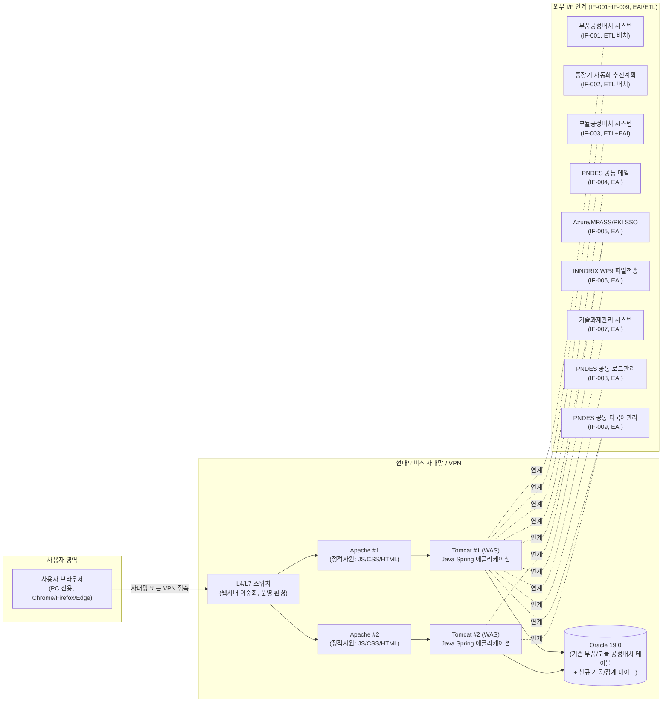

# 인프라 아키텍처 (kbt)

**프로젝트명**: PLM 생기포털 고도화 — 공정 자동화 현황 및 중장기 방향성 공유 신규 기능 구축
**작성일**: 2026-08-07
**최종 갱신일**: 2026-08-08 (kbt 검토 브랜치, 2차 갱신)
**버전**: v1.2-kbt
**근거 문서**: `02.기획문서/화면설계서_kbt.md`(FLOW-MAP·DASH-AUTO·DASH-MTRM·MTRM-MAIN 포함 18개 화면), `02.기획문서/API스펙_kbt.md`(I/F 설계서, IF-001~IF-009), `03.구현문서/시스템정의서_kbt.md`(Java Spring/Oracle 19.0 시스템 구성), `PRD.md`(부록 J 비기능요구사항)

> 본 문서는 공식 산출물 `인프라아키텍처.md`(2026-08-07 확정)를 훼손하지 않는 별도 검토 브랜치입니다. Gate-Check/`.progress.md` 추적 대상이 아닙니다.
>
> **kbt 검토 결과(2026-08-08, 1차)**: FLOW-MAP·DASH-AUTO·DASH-MTRM 3개 화면 신규 반영은 기존 Apache/Tomcat/Oracle 온프레미스 구성 내에서 처리되는 **순수 조회(read-only) 화면**으로, 서버 증설·신규 I/F·신규 DB 인스턴스 등 인프라 변경 사항이 없습니다. 본 문서의 시스템 구성도·용량산정·배포 전략은 공식 문서(v1.0)와 동일하게 유지합니다.
>
> **kbt 검토 결과(2026-08-08, 2차 — 변경 없음 확인)**: MTRM-MAIN 신규 화면 반영, 좌측 GNB 구성 정정(DASH-AUTO/DASH-MTRM 제외), 등록 모달 필드 확정 등은 모두 프론트엔드 화면/데이터 표현 범위의 변경으로, 인프라 구성·용량·배포 전략에 영향이 없습니다. 본 절 이하 내용은 1차본과 동일하게 유지합니다.

> 본 프로젝트는 현대모비스 생산기술포털(PNDES) 기존 전사 시스템 내 신규 메뉴를 증설하는 **온프레미스 시스템 증설 프로젝트**입니다. CLAUDE.md 정의에 따라 AP-Framework V0.43 기본 클라우드 아키텍처(CDN, Vercel, Supabase, 오토스케일링 등 클라우드 네이티브 개념)는 **적용하지 않습니다.** 인프라는 PNDES 고객사 표준(Redhat Linux 8.10, Apache/Tomcat, Oracle 19.0, Azure/MPASS/PKI SSO, 온프레미스 배포)을 그대로 따르며, "M1~M5 통합/분리 전략"(V0.43 기본 정책) 또한 본 프로젝트에는 적용하지 않습니다.

---

## 1. 시스템 구성도

**구성 설명**

| 구간 | 내용 |
|---|---|
| 사용자 브라우저 | PC 전용(1920px), JQuery+HTML5 기반 PNDES 공통 UI 표준 화면(SCR-001~014) |
| 접근 경로 | 현대모비스 사내망 직접 접속 또는 사외 VPN 경유 (별도 공개 인터넷 노출 없음) |
| L4/L7 스위치 | 운영 환경에서 Apache/Tomcat 이중화 트래픽 분산. 개발 환경은 단일 서버로 스위치 미적용 |
| Apache | 정적자원(HTML/CSS/JS/이미지) 서빙, Tomcat으로 리버스 프록시 |
| Tomcat(WAS) | Java Spring 기반 신규 메뉴 2건(공정 자동화 현황, mTRM 중장기 방향성 공유) 애플리케이션 구동 |
| Oracle 19.0 | 기존 부품/모듈 공정배치 원천 테이블 재사용 + 신규 가공(집계) 테이블(자동화율, 성인화 등) |
| 외부 I/F | `02.기획문서/API스펙.md`의 IF-001~IF-009, PNDES 내부망 EAI 솔루션 또는 DB Link/배치 Job 경유 |

---

## 2. 서버 구성

> 본 증설 프로젝트는 PNDES 기존 서버 인프라를 활용하며, 별도의 신규 클라우드 인스턴스를 생성하지 않습니다. PRD.md 부록 J(비기능요구사항)의 "테스트서버 제공"에 따라 개발/QA 단계에서는 고객사가 제공하는 테스트서버를 사용합니다.

| 구분 | 환경 | OS | WAS/미들웨어 | 이중화 | 용도 |
|---|---|---|---|---|---|
| 개발 서버 | 개발 | Redhat Linux 8.10 | Apache/Tomcat (단일) | 미적용 | 개발자 소스 배포, 단위기능 개발/디버깅 |
| 테스트 서버 | 스테이징 | Redhat Linux 8.10 | Apache/Tomcat (단일) | 미적용 | 단위테스트(주 단위기능 완료 시 병행), 통합테스트, 고객 검수(PRD.md 부록 J 근거) |
| 운영 서버 | 운영 | Redhat Linux 8.10 | Apache/Tomcat (Active-Active 이중화) | 적용(L4/L7 스위치 부하분산) | 실 서비스 운영, 전 사용자 접근 |
| DB 서버 | 개발/테스트 | Redhat Linux 8.10 | Oracle 19.0 (단일 인스턴스) | 미적용 | 개발/테스트용 스키마, 기존 부품/모듈 공정배치 테이블 미러링 또는 참조 |
| DB 서버 | 운영 | Redhat Linux 8.10 | Oracle 19.0 (기존 운영 DB 확장) | 고객사 기존 DB 이중화 정책 준용 | 신규 가공(집계) 테이블 추가, 기존 원천 테이블(부품/모듈 공정배치) 연계 조회 |

> 서버 사양(CPU/메모리/스토리지)은 PNDES 기존 인프라 용량 산정 정책에 따라 고객사(현대오토에버)가 배정하며, 본 문서 작성 시점에는 상세 사양이 확정되지 않아 착수 후 인프라팀 협의를 통해 확정합니다.

---

## 3. 네트워크 구성

| 항목 | 내용 |
|---|---|
| 접근 제어 | 사내망 기준 접근 제어. 신규 메뉴는 PNDES 기존 SSO 로그인 이후에만 접근 가능하며, 별도의 공개(비인증) 구간은 두지 않음. 사외 접속은 VPN 경유만 허용 |
| 도메인 | 별도 신규 도메인 없음. 기존 PNDES 도메인(예: `pndes.mobis.co.kr`) 하위 경로로 통합 — SCR-001~014는 `/pndes/automation/*`, `/pndes/mtrm/*` 경로로 신규 메뉴 편입 |
| SSL | NFR-002(개인정보 암호화, 중요 데이터 SSL 적용)에 따라 전 화면 HTTPS 적용. 기존 PNDES 인증서(고객사 발급/관리) 재사용, 신규 인증서 발급 없음 |
| 방화벽 정책 | 외부 I/F 연계 대상 시스템별로 인바운드/아웃바운드 규칙을 개별 적용 (아래 표 참고) |

**I/F 연계 대상별 방화벽 정책**

| 연계 대상 시스템 (관련 I/F) | 방향 | 정책 |
|---|---|---|
| 부품공정배치 시스템 (IF-001) | 인바운드(수신) | PNDES 내부 시스템 간 DB Link/배치 Job, IP 화이트리스트 + 서비스 계정 인증 |
| 중장기 자동화 추진계획 (IF-002) | 인바운드(수신) | PNDES 내부 시스템 간 배치 Job, IP 화이트리스트 |
| 모듈공정배치 시스템 (IF-003) | 인바운드(수신) | 배치 Job(야간) + 실시간 이벤트 수신 포트 개방, IP 화이트리스트 + 서비스 계정 |
| PNDES 공통 메일 발송 (IF-004) | 아웃바운드(발신) | PNDES 공통 기능 API 호출, 내부망 한정 |
| Azure/MPASS/PKI SSO (IF-005) | 인바운드/아웃바운드 | SSO 토큰 검증 트래픽, PNDES 표준 SSO 연계 정책 준용(별도 개방 불요, 기존 SSO 인프라 재사용) |
| INNORIX WP9 (IF-006) | 송수신 | 파일 업/다운로드 트래픽, 허용 확장자/유해파일 정책 적용, 내부망 한정 |
| 기술과제관리 시스템 (IF-007) | 인바운드(수신, 이벤트) | PNDES 내부 시스템 간 이벤트 수신 포트 개방, IP 화이트리스트 |
| PNDES 공통 로그/이력 관리 (IF-008) | 아웃바운드(발신) | PNDES 공통 기능 API 호출, 내부망 한정 |
| PNDES 공통 다국어 관리 (IF-009) | 아웃바운드(발신, 조회) | PNDES 공통 기능 API 호출, 캐시 적용 권장, 내부망 한정 |

> 모든 연계는 PNDES 내부망을 벗어나지 않으며, 외부 공개 인터넷 구간의 인바운드 개방은 발생하지 않습니다.

---

## 4. 배포 환경

| 환경 | 경로/접근 | 용도 | 배포 방식 |
|---|---|---|---|
| 개발 | 개발 서버 (내부 접근) | 개발자 소스 배포, 기능 개발/디버깅 | 고객사 형상관리 정책에 따른 수동/반자동 배포 |
| 스테이징(테스트서버) | 테스트 서버 (내부 접근, PRD.md 부록 J 근거) | 단위테스트, 통합테스트(고객 정의 시나리오), 결함관리(재시험) | 고객사 운영 프로세스에 따른 배포, 형상관리 이력 기록 |
| 운영 | `pndes.mobis.co.kr` 하위 경로 (신규 메뉴 편입) | 실 서비스 운영 | 고객사(현대오토에버) 지정 온프레미스 운영 프로세스에 따른 정식 배포 |

> **배포 방식 원칙**: 실제 배포는 Vercel/Supabase 등 클라우드 자동 배포를 사용하지 않으며, **고객사 운영 프로세스(PRD.md 부록 J 비기능요구사항 — 테스트/결함관리 기준)를 따릅니다.** GitHub Actions는 본 프로젝트 형상관리 저장소 내 **문서/산출물 버전관리 및 커밋 알림(n8n 연계) 등 보조 용도로만 사용**하며, PNDES 실 운영 환경으로의 배포 파이프라인에는 사용하지 않습니다.

---

## 5. 외부 연동 서비스 (I/F 요약 재인용)

> 상세 내용은 `02.기획문서/API스펙.md`(I/F 설계서) 참고. RESTful API 대신 PNDES 표준 EAI/ETL 방식을 사용합니다.

| I/F-ID | 서비스명 | 용도 | 연동 방식 |
|---|---|---|---|
| IF-001 | 부품공정배치 시스템 (PNDES 내) | 부품 공정 자동화 현황(F-001, F-002) 원본 데이터 수신 | ETL(배치, 1일 1회 야간) |
| IF-002 | 중장기 자동화 추진계획 (PNDES 내) | 성인화 계획 등 중장기 확대전개 계획 데이터 수신 | ETL(배치, 1일 1회 야간) |
| IF-003 | 모듈공정배치 시스템 (PNDES 내) | 모듈 공정 자동화 현황(F-005, F-006, F-009) 데이터 수신 | ETL(배치) + EAI(실시간 변경 이벤트) |
| IF-004 | PNDES 공통 메일 발송 기능 | Tech PR 문의(F-014), mTRM 협의체 등록(F-016) 메일 발송 | EAI(실시간 API 호출) |
| IF-005 | Azure / MPASS / PKI (SSO) | 전 화면 접근 사용자 인증/권한 매핑 | EAI(실시간, 토큰 검증) |
| IF-006 | INNORIX WP9 | 첨부파일 업/다운로드(F-002, F-013~F-015, F-019) | EAI(실시간) |
| IF-007 | 기술과제관리 시스템 (PNDES 내) | 기술과제 계획등록-mTRM 로드맵(F-018) 매핑 연동 | EAI(실시간 이벤트) |
| IF-008 | PNDES 공통 사용자 로그/이력 관리 | 조회/다운로드/메일공유 이력 연계 | EAI(실시간) |
| IF-009 | PNDES 공통 다국어 관리 | 화면 UI 텍스트 한/영/중 다국어 표출 | EAI(실시간 조회, 캐시 권장) |

---

## 6. 백업/장애 대응

| 항목 | 내용 | 근거 |
|---|---|---|
| 하자보수 | 오픈 후 **무상 하자보수 12개월** 적용, 기간 내 결함은 원인추적 → 재시험 → Close 프로세스 준용 | PRD.md 부록 J |
| 장애 대응 | 장애 발생 통보 후 **2시간 이내 현장 도착 및 조치** | PRD.md 부록 J |
| 결함관리 | 중요도 분류 → 원인추적 → 재시험 → Close, 미해결 결함은 오픈 전 고객 협의 | PRD.md 부록 J |
| 데이터 백업 | 신규 가공(집계) 테이블은 기존 Oracle 19.0 운영 DB 백업 정책(고객사 표준 백업/보존주기)에 편입, 별도 백업 체계 신설 없음 | PNDES 기존 인프라 정책 준용 |
| I/F 장애 대응 | 연동 실패 시 재처리 큐 등록(최대 3회 재시도) → 지속 실패 시 담당자 알림 → I/F 실행 결과(성공/실패) 이력 테이블에 기록 | API스펙.md(I/F 설계서) 공통 오류처리 정책, NFR-007 |
| 오픈 초기 대응 | 오픈(1차 2026년 9월 말, 2차 2026년 12월 말) 직후 장애 최소화를 위해 하자보수 계획에 따른 대응 체계 즉시 가동 | PRD.md 부록 J, WBS.md |

---

## 참고 문서

- `02.기획문서/화면설계서_kbt.md` (FLOW-MAP·DASH-AUTO·DASH-MTRM 포함 17개 화면)
- `02.기획문서/API스펙_kbt.md` (I/F 설계서, IF-001~IF-009)
- `03.구현문서/시스템정의서_kbt.md` (Java Spring/Oracle 19.0 시스템 구성)
- `PRD.md` (부록 J — 비기능요구사항, 테스트서버 제공, 하자보수/장애대응 기준)
- `05.리포트/변경이력_kbt.md` (kbt 브랜치 전체 변경 근거 자료)
