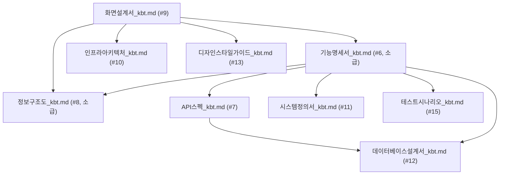
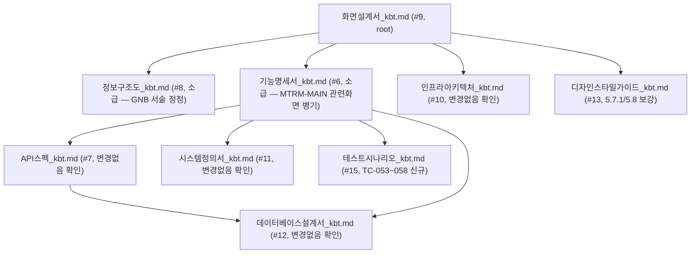

# 변경이력 (kbt 브랜치) — 근거 자료

**작성일**: 2026-08-08
**목적**: PNDES 신규 메뉴(공정 자동화 현황 / 중장기 방향성 공유) 프로토타입에 이번 세션 동안 반영된 모든 변경사항과, 그로부터 파생된 `_kbt` 문서 브랜치의 근거를 한 곳에 정리합니다.
**성격**: 본 문서는 05.리포트/ 소속(Document Chaining 17단계 외 온디맨드 참고자료)이며, NotebookLM 등록 대상이 아닙니다. `.progress.md`(Gate-Check 공식 추적기)도 변경하지 않았습니다 — 아래 `_kbt` 문서들은 모두 공식 Document Chain과 별개인 **검토용 브랜치**입니다.

---

## 1. 변경 배경 및 순서

| 순서 | 내용 | 트리거 |
|---|---|---|
| 1 | Claude Design 프로젝트(`첨부파일 기반 프로토타입`, projectId `3720cee3-5bf1-464c-921e-bacab13ffc93`)에서 `PNDES Portal Prototype.dc.html` + `support.js`를 DesignSync로 임포트 | 사용자 요청: "SCR-003(모듈 공정) 화면과 DASH-AUTO(통합 대시보드) 화면을 첨부 소스 기준으로 변경, 로컬호스트로 확인" |
| 2 | `src/frontend/js/render.js`, `data.js`, `css/common.css` 수정 — SCR-003 "+ 작업내용 등록" 라벨, DASH-AUTO 3단 패널 재구성(부품/모듈/전체 자동화율) + "중장기 확대 전개 로드맵" 4열 카드 | 위 1의 결과 반영 |
| 3 | Playwright로 로컬(`http://localhost:8080`) 렌더링 검증 | 셀프 검증 |
| 4 | SCR-003 "총 성인화(실적/계획)" 표를 연도별 서브행 → 컬럼별 단일 행(연도+실적/계획 병기)으로 수정 | 사용자 요청: 화면 표기 단순화 |
| 5 | I/F 실행결과 관리(SCR-005) 메뉴 기능 설명 | 사용자 질의(문서 변경 없음) |
| 6 | `05.리포트/화면설계서_사용자파트.html` 생성 (sb-creator-kbt 스킬, 사용자 파트 11개 화면 실 캡처 + PPTX 버튼) | 사용자 요청 |
| 7 | `05.리포트/화면설계서_사용자파트_kbt.md` → 파일명 정정(`.html`) 및 SCR-014 상세보기 서브상태 추가, 총 12개 화면으로 재생성 | 사용자 요청: "/sb-creator-kbt 사용해서, 누락 화면 없이" |
| 8 | 위 6~7의 실 구현 변경사항을 **공식 Document Chain 산출물**(02.기획문서, 03.구현문서, 04.검수문서)에 반영 — `_kbt` 접미사 신규 파일로 생성 | 사용자 요청: "화면설계서 갱신 → 화면설계서에 의존/영향받는 모든 산출물 갱신, 전부 `_kbt` 신규 파일로" |

---

## 2. 1차 반영 — 구현 코드 변경 (`src/frontend/`)

### 2.1 SCR-003 모듈 공정 자동화 현황
- **근거**: Claude Design 소스 `PNDES Portal Prototype.dc.html`의 `isSCR003` 템플릿 블록
- `render.js` `renderSCR003()`: 등록 버튼 라벨 `"+ 공정 등록"` → `"+ 작업내용 등록"`
- `data.js` `scr003SummaryRows`: "총 성인화(실적/계획)" 행을 연도별 `subRows`(`'26년~'30년`) 방식에서 **컬럼별 "연도+실적/계획" 단일 문자열 병기**(예: `"'28년 0명 / 6명"`)로 변경
- `render.js` `renderScr003SummaryTable()`: `subRows` 렌더링 분기 제거(더 이상 필요 없음)

### 2.2 DASH-AUTO 공정 자동화 현황 통합 대시보드
- **근거**: Claude Design 소스의 `isDASHAUTO` 템플릿 블록(요약지표 5카드 → 부품/모듈/도넛 3패널 → 매트릭스+I/F결과 2패널 → 확대전개 로드맵 카드그리드 → 바로가기)
- `render.js`에 `computeModuleAutoBars()`, `computeModuleDirectStaff()` 신규 — SCR-003 데이터(`scr003SummaryRows`, `scr003LineCols`)를 라이브 재계산(SCR-001 자동화율 재사용 패턴과 동일 원칙)
- `renderDASHAUTO()` 전면 재구성: 부품 공정/모듈 공정/전체 자동화율 3패널(패널 헤더에 바로가기 링크) + "중장기 확대 전개 로드맵" 4열 카드 그리드(`renderExpansionRoadmapPanel()`, 기존 리스트형 패널 대체)
- `data.js`에 `scr001Expansion` 배열 신규(라인/목표연도/진행률/상태 4건)
- `common.css`에 `.panel-head-row`, `.panel-link`, `.expansion-card-*` 클래스 신규 추가

### 2.3 검증
- Playwright 스크린샷으로 DASH-AUTO, SCR-003 렌더링 확인 (모두 정상)

---

## 3. 2차 반영 — 화면설계서 HTML 산출물 (`05.리포트/`)

| 파일 | 스킬 | 화면 수 | 비고 |
|---|---|---|---|
| `화면설계서_사용자파트.html` | sb-creator-kbt | 11개(사용자 파트, 관리자 6개 제외) | PDF/편집가능 PPTX 버튼 포함, Playwright로 PPTX 내 이미지 12/12 포함 검증 |
| `화면설계서_사용자파트_kbt.html` | sb-creator-kbt | 12개(11개 + SCR-014 상세보기 서브상태) | 신규 파일, 위 문서와 별개 URL/파일 유지. PPTX 13슬라이드/13미디어 검증 완료 |

---

## 4. 3차 반영 — 공식 Document Chain 산출물의 `_kbt` 브랜치

> **범위 결정**: `화면설계서.md`(#9)에 직접 의존하는 산출물(#10 인프라아키텍처, #13 디자인스타일가이드)뿐 아니라, 사용자 지시에 따라 `화면설계서_kbt.md`에 영향을 준 상위 산출물(#8 정보구조도, #6 기능명세서)까지 함께 갱신하고, #6 기능명세서의 하위 산출물 전체(화면설계서 자신은 제외)도 함께 갱신했습니다.
>
> **`.progress.md` 처리**: 사용자 결정에 따라 공식 라인(`.progress.md`, 원본 파일 경로)은 전혀 수정하지 않았습니다. 아래 `_kbt` 파일들은 Gate-Check 비대상 별도 검토 브랜치입니다.

### 4.1 변경 파일 목록

| # | 공식 파일 | kbt 파일 | 주요 변경 내용 |
|---|---|---|---|
| 9 | `02.기획문서/화면설계서.md` | `화면설계서_kbt.md` | FLOW-MAP·DASH-AUTO·DASH-MTRM 3개 화면 신규 섹션(총 17개 화면), SCR-003 UI 변경 2건 반영, 화면 목록 표 갱신, 3.5/3.6 신규 공통 컴포넌트 패턴 추가 |
| 8 | `02.기획문서/정보구조도.md` | `정보구조도_kbt.md` | 사이트맵(mermaid)에 FLOW-MAP/DASH-AUTO/DASH-MTRM 노드 + 데이터 재사용 관계 추가, 화면-기능 매핑 표·접근권한 표·내비게이션 원칙에 3개 화면 반영(신규 F-ID 없음 명시) |
| 6 | `02.기획문서/기능명세서.md` | `기능명세서_kbt.md` | F-001/F-005/F-009/F-010/F-011/F-016/F-019의 "관련 화면" 항목에 DASH-AUTO/DASH-MTRM 재사용 관계 병기(신규 F-ID 추가 없음) |
| 7 | `02.기획문서/API스펙.md` | `API스펙_kbt.md` | 헤더에 "신규 I/F 없음" 명시(DASH-AUTO/DASH-MTRM은 기존 IF-001/IF-003 결과 재조회) |
| 11 | `03.구현문서/시스템정의서.md` | `시스템정의서_kbt.md` | 모듈 구성표에 "대시보드 모듈(kbt 신규)" 추가(신규 DB/신규 로직 없는 조회 전용 조립 계층), 패키지 구조에 `dashboard` 패키지 추가 |
| 15 | `04.검수문서/테스트시나리오.md` | `테스트시나리오_kbt.md` | TC-047~TC-052 6건 신규(총 52건) — SCR-003 표기 변경 검증 2건 + DASH-AUTO/DASH-MTRM 데이터 정합성·내비게이션 검증 4건 |
| 12 | `03.구현문서/데이터베이스설계서.md` | `데이터베이스설계서_kbt.md` | 헤더에 "신규 테이블 없음" 명시(기존 6개 테이블 읽기 전용 재조회 매핑) |
| 10 | `03.구현문서/인프라아키텍처.md` | `인프라아키텍처_kbt.md` | 헤더에 "인프라 변경 없음"(신규 서버/I/F/DB 인스턴스 없는 순수 조회 화면) 명시 |
| 13 | `03.구현문서/디자인스타일가이드.md` | `디자인스타일가이드_kbt.md` | 5.9(KPI 카드), 5.10(대시보드 패널 헤더+바로가기), 5.11(확장 카드형 진행률) 신규 절 추가, `common.css` 실 구현 클래스와 1:1 매핑 |

### 4.2 공통적으로 적용한 원칙
- **신규 기능(F-ID)·신규 I/F·신규 DB 테이블을 추가하지 않았습니다.** FLOW-MAP/DASH-AUTO/DASH-MTRM은 전부 기존 화면(SCR-001~014)의 조회 결과를 읽기 전용으로 재사용/집계 표출하는 내비게이션·대시보드 허브입니다.
- 각 kbt 문서 상단에 "본 문서는 공식 산출물 OOO.md를 훼손하지 않는 별도 검토 브랜치이며 Gate-Check/.progress.md 추적 대상이 아니다"라는 동일한 고지문을 부착했습니다.
- 각 kbt 문서의 "참고 문서" 절은 서로를 `_kbt` 버전으로 상호 링크하도록 갱신했습니다.

---

## 5. 참고 — 원본 소스

- Claude Design 프로젝트: `첨부파일 기반 프로토타입` (projectId: `3720cee3-5bf1-464c-921e-bacab13ffc93`), 파일 `PNDES Portal Prototype.dc.html`, `support.js`
- 업로드된 참고 PDF(Claude Design 프로젝트 내): `모듈 공정 자동화 현황.pdf`, `모듈 공정 자동화 현황 화면.pdf`, `모듈 자동화 현황_as-is.pdf`, `dash_module.pdf`, `dash_part.pdf` 등
- 디자인 핸드오프 번들: `design_handoff_pndes_portal/README.md`(좌측 GNB 최종 구조·디자인 토큰·인터랙션 스펙), `design_handoff_pndes_portal/PNDES Portal Prototype.dc.html`(위 Claude Design 소스와 동일본), `design_handoff_pndes_portal/screenshots/*.png`(SCR-001·MTRM-MAIN·SCR-006·SCR-008·SCR-009 레퍼런스 캡처)
- 실 구현: `src/frontend/js/render.js`, `src/frontend/js/data.js`, `src/frontend/js/app.js`, `src/frontend/css/common.css`
- 화면설계서 HTML: `05.리포트/화면설계서_사용자파트.html`, `05.리포트/화면설계서_사용자파트_kbt.html`

---

## 6. 2차 세션 반영 — GNB 정합화·MTRM-MAIN·등록 모달 확정 (2026-08-08, 이어지는 세션)

### 6.1 변경 배경 및 순서

| 순서 | 내용 | 트리거 |
|---|---|---|
| 1 | Claude Design 소스 재동기화 — `PNDES Portal Prototype.dc.html`의 `NAV` 배열에서 '가이드' 그룹(FLOW-MAP/NAV-OPT)이 상류에서 이미 제거된 것을 확인 | 사용자 요청: "클로드 소스로 전체 프론트 화면 수정" |
| 2 | `design_handoff_pndes_portal/` 번들(README.md + 스크린샷 5종) 도착 — 화면별 정밀 비교(에이전트 위임)로 SCR-001/003 데이터 오류, MTRM-MAIN 누락, SCR-006/007/008/009 레이아웃 요소 누락 등을 발견·수정 | 사용자 요청: "전체적으로 수정된 화면이 많은데 다시 확인해서 변경" |
| 3 | 사용자 확인 화면 캡처 기준으로 좌측 GNB에서 DASH-AUTO/DASH-MTRM 통합 대시보드 2개를 제외 | 사용자 스크린샷 첨부 + "좌측 메뉴 수정해줘" |
| 4 | SCR-014(기술동향) "+ 등록", SCR-012(mTRM 관리) "+ mTRM 등록" 버튼에 실제로 연결되어 있지 않던 등록 모달을 신규 구현 | 사용자 스크린샷 첨부(각 팝업 디자인) |
| 5 | 최초 접속 시 랜딩 화면을 `DASH-AUTO` → `SCR-001`(부품 공정 자동화 현황)로 변경, 로컬 정적 서버(`http://localhost:8080`) 기동 | 사용자 요청 |
| 6 | 위 2~5의 실 구현 변경사항을 화면설계서_kbt.md(root) 및 영향 범위(정보구조도_kbt.md, 기능명세서_kbt.md, 디자인스타일가이드_kbt.md, 인프라아키텍처_kbt.md, API스펙_kbt.md, 시스템정의서_kbt.md, 데이터베이스설계서_kbt.md, 테스트시나리오_kbt.md)에 소급 반영 | 사용자 요청: "/docs-cascade-kbt 활용해서 화면설계서 갱신하고 연관 문서도 업데이트" |

### 6.2 구현 코드 변경 요약 (`src/frontend/`)

| 커밋/변경 | 내용 |
|---|---|
| `7a08563` | MTRM-MAIN 신규 구현, SCR-006 하위 SCR-007/008 서브메뉴, SCR-001/003 매트릭스 표 구조·데이터 오류 수정, SCR-006 KPI 카드, SCR-007 빈 상태 CTA, SCR-008 연도헤더·범례·지그재그, SCR-009 4종 자료유형 썸네일/배지 + 커스텀 상세 오버레이 |
| `6b66739` | `data.js` NAV 배열에서 `DASH-AUTO`/`DASH-MTRM` 제외(좌측 GNB 정합화), SCR-014 "+ 등록" → `trendRegister` 모달 신규 연결(제목/구분/태그/내용/첨부파일) |
| `dcb47b4` | SCR-012 "+ mTRM 등록" → `mtrmRegister` 모달 신규 연결(mTRM명/분과/상태/등록일) |
| (미커밋, 이번 라운드에서 커밋 예정) | `app.js` `state.currentScreen` 기본값 `'DASH-AUTO'` → `'SCR-001'`(초기 랜딩 화면 변경) |

### 6.3 문서 갱신 — Document Chain 영향 범위 (DAG 기반)

### 6.4 변경 파일 목록

| # | kbt 파일 | 주요 변경 내용 |
|---|---|---|
| 9 | `화면설계서_kbt.md` (v1.2-kbt) | MTRM-MAIN 신규 절, 1.1절 GNB 구조/초기 랜딩화면 신규, SCR-006 서브메뉴 노트, SCR-008 범례/연도헤더/지그재그, SCR-009 4종 유형별 썸네일·오버레이, SCR-012/014 등록 모달 필드 확정 |
| 8 | `정보구조도_kbt.md` (v1.2-kbt) | 사이트맵에 MTRM-MAIN 노드 추가, DASH-AUTO/DASH-MTRM을 "내비게이션 허브"→"GNB 미노출·URL 직접 접근"으로 서술 정정, 화면-기능 매핑·접근권한 표에 MTRM-MAIN 반영, "1차/2차 오픈 메뉴 노출"·"대시보드 우선 진입" 서술 정정 |
| 6 | `기능명세서_kbt.md` (v1.2-kbt) | F-010/F-011/F-013/F-019의 "관련 화면"에 MTRM-MAIN 병기(신규 F-ID 없음) |
| 7 | `API스펙_kbt.md` (v1.2-kbt) | 변경 없음 확인 |
| 11 | `시스템정의서_kbt.md` (v1.2-kbt) | 변경 없음 확인(1차 신설 대시보드 모듈을 MTRM-MAIN이 재사용) |
| 12 | `데이터베이스설계서_kbt.md` (v1.2-kbt) | 변경 없음 확인(신규 테이블 없음) |
| 15 | `테스트시나리오_kbt.md` (v1.2-kbt) | TC-053~058 6건 신규(총 58건) — MTRM-MAIN 재사용 정합성, GNB 미노출 검증, 서브메뉴, 등록 모달 2건, Tech PR 오버레이 |
| 10 | `인프라아키텍처_kbt.md` (v1.2-kbt) | 변경 없음 확인 |
| 13 | `디자인스타일가이드_kbt.md` (v1.2-kbt) | 5.7.1절(Tech PR 자료유형별 배지·썸네일 색상, Purple 시맨틱 컬러 신규) 추가, 5.8절(간트차트) 연도헤더·범례·지그재그 보강 |

### 6.5 1차 서술 정정 사항 (중요)

1차 kbt 문서는 "DASH-AUTO/DASH-MTRM이 좌측 GNB의 내비게이션 허브"라고 서술했으나, 이번 라운드에서 사용자가 확인한 최종 화면 캡처 및 `design_handoff_pndes_portal/README.md` 대조 결과 **두 화면은 실제로 GNB 메뉴에 노출되지 않는 URL 직접 접근용 대시보드**였음을 확인했습니다. 화면·기능·데이터·I/F 자체는 변경되지 않았고 **GNB 노출 여부에 대한 서술만 정정**했습니다(신규 F-ID 없음). 정정 근거는 정보구조도_kbt.md 헤더 "kbt 변경 이력(2026-08-08, 2차)" 참고.
