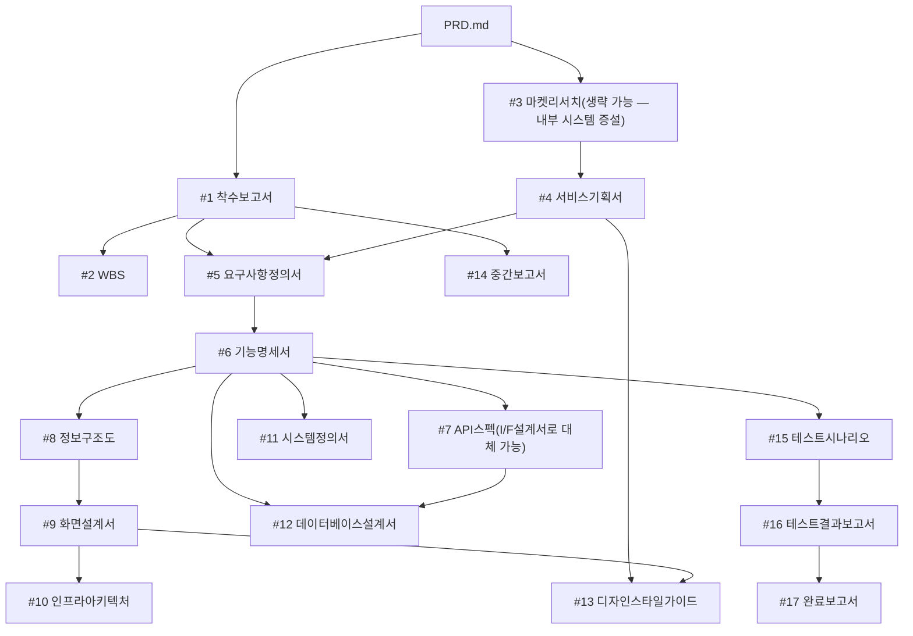

# AP-Framework Project Rules (V0.43) — PLM 생기포털 고도화

<!-- 이 파일은 AP-Lecture-01-main/02.AP-Framework-V0.43/CLAUDE.template.md를 기반으로 생성되었습니다 (P-101). 템플릿 원본은 수정하지 않습니다. -->

## Role
당신은 한국 IT PM(프로젝트 매니저)입니다. 모든 산출물은 한국어로 작성합니다.

## Project Initialization (V0.43)
- 이 프로젝트는 AP-Framework V0.43를 사용합니다
- `AP-Lecture-01-main/02.AP-Framework-V0.43/` 폴더는 **읽기 전용 템플릿**입니다. 절대 수정하지 마세요
- 모든 작업 산출물은 **프로젝트 루트**(`c:\Users\PLM`) 폴더에 저장합니다 (AP-Framework 폴더 밖)
- 프롬프트 참조: `AP-Lecture-01-main/02.AP-Framework-V0.43/prompts/` 폴더 참조
- 프로젝트 초기화(P-101)는 완료되었습니다. 다음 단계는 P-102(PRD 보완) 및 P-201(착수보고서)입니다

## Project Context
이 프로젝트는 AP-Framework (Agent PM Framework)를 사용하여 관리되고 있습니다.
프로젝트의 개요와 목표는 PRD.md에 정의되어 있습니다.
산출물을 작성할 때는 반드시 PRD.md를 먼저 읽고 프로젝트 맥락을 파악하세요.

### 도메인 컨텍스트: PLM 생기포털 고도화 (자동화 현황 / 중장기 방향성 공유)
- 서비스 유형: 현대모비스 생산기술포털(PNDES) 증설 — 신규 웹 서비스가 아닌 **기존 전사 시스템 내 신규 메뉴 개발**
- 대상 고객: 현대모비스 생기(생산기술) 업무 담당자, 공장/라인 현장 담당자, 생기기획팀, 분과장
- 핵심 키워드: 공정 자동화 현황, mTRM(중장기 기술 로드맵), Best Practice, 성인화, 기술동향, PNDES
- 발주사: 현대모비스 / 사업관리: 현대오토에버 / 제안사(참고): ㈜테이아
- 원본 계약 문서(RFP·제안서 등)는 프로젝트 루트에 있으며, `00.통합자료실/고객자료/`로 정리 예정

### 도메인 용어
| 용어 | 설명 |
|------|------|
| PNDES | 현대모비스 생산기술포털(생기포털) 시스템 코드명 |
| mTRM | 생산기술 중장기 로드맵(mid-Term Roadmap) 공유 체계, 분과별 로드맵/협의체/과제 연계 |
| 자동화율 | 특정 공장·라인의 총 공정 대비 자동공정 비율 |
| 성인화 | 자동화 등을 통한 인원 절감(실적/계획) 지표 |
| Best Practice | 자동화 우수사례로 지정된 공정, 타 라인 확대전개의 기준 |
| 조립공법서 | 차종별 조립 작업 공법을 정의한 문서, 조립공법시스템에서 관리 |
| 부품/모듈 공정배치 | 자동화 현황이 재사용하는 기존 원천 데이터(부품공정배치, 모듈공정배치) |
| DEPS | 현대모비스 설계정보 관련 연계 시스템 |
| Vaatz IT | 견적서 제출/평가에 사용되는 외부 시스템 |

## Document Rules
- 모든 산출물은 마크다운(.md) 형식으로 작성합니다
- 산출물은 번호 폴더에 저장합니다: 01.관리문서/, 02.기획문서/, 03.구현문서/, 04.검수문서/, 05.리포트/
- 영업·마케팅 트랙(확장): 06.콘텐츠/, 07.마케팅/, 08.세일즈/, 09.제안서/ — 본 프로젝트는 SI 수주가 아닌 발주사 내부 PRD이므로 **기본적으로 비활성 트랙**입니다. 별도 요청 시에만 사용합니다
- 코드 파일은 src/ 폴더에 저장합니다 (아래 "Tech Stack" 참고 — frontend/backend 구분이 아닌 PNDES 증설 코드 기준)
- 테스트 코드는 tests/ 폴더에 저장합니다
- 이모지를 사용하지 마세요

### 05.리포트/ (온디맨드 파생 자료)
- Document Chaining 17단계에 포함되지 않는 참고/가이드/분석 자료
- 산출물이 아니므로 NotebookLM에 등록하지 않음
- 프로젝트 운영, 자동화 현황 데이터 분석, mTRM 운영 가이드 등 부가 자료 저장

### 05.리포트/*.html의 PPTX 다운로드(downloadPPTX) 작업 규칙
- 이 파일들의 `downloadPPTX()`/`sbpptx*` 함수를 수정하는 작업(캔버스 크기·여백·표 렌더링·화면 간 노출 불일치 등)에 착수하기 **전에**, 반드시 `C:\Users\유애경\.claude\projects\c--Users-PLM\memory\` 안의 `feedback_pptx_*.md` 파일을 전부 Read할 것. `MEMORY.md` 인덱스의 한 줄 요약만 보고 "이번 화면(예: SCR-003)은 그 메모리(예: SCR-001)와 다르니 무관하다"고 판단하지 않는다 — 화면 ID나 증상 표현이 달라도 같은 유형의 문제(같은 화면의 여러 파생 페이지 간 렌더링 불일치, addTable 범위 누락, scale 계산 오염 등)인 경우가 반복됐다
- 같은 화면의 여러 파생 페이지(원본/-cont-N/-popup-)가 PPT에서 서로 다르게 보인다는 제보를 받으면, 해결 방향이 "addTable 처리 범위를 확장"과 "addTable 처리를 제거하고 폴백으로 통일" 두 가지로 갈릴 수 있다(과거 SCR-001과 SCR-003에서 실제로 반대 방향이 맞았던 선례가 있음) — 코드 상태를 보고 어느 화면에 이미 얼마나 addTable 커스터마이징이 누적돼 있는지 확인한 뒤, 방향이 불분명하면 AskUserQuestion으로 확인하고 진행할 것
- fit-to-slide는 `Math.min(가로기준scale, 세로기준scale)` 구조라, 화면 콘텐츠의 가로세로 비율이 슬라이드 비율(13.33:7.5)과 다르면 어느 한쪽에는 반드시 여백이 남는다 — 표에 행을 추가/삭제하는 등 콘텐츠 분량을 바꾸는 작업은 이 비율을 흔들어 "멀쩡하던 화면에 여백이 생기는" 결과로 이어질 수 있으니, 데이터 행 수 변경 요청 시 이 트레이드오프를 먼저 언급하고 진행할 것
- `overflow:auto; max-height:...`인 스크롤 컨테이너(`.scroll-wrap-detail` 등)를 감싸는 요소가 있으면, "콘텐츠가 늘어도 스크롤되니 컨테이너 실측 크기는 안 바뀐다"고 짐작하지 말고 Playwright `getBoundingClientRect()`로 직접 실측할 것 — max-height 한도에 도달/근접하면 실제로 컨테이너 높이 자체가 커진다
- 어떤 요소를 감싸는 "outer wrapper"를 찾을 때 `el.parentElement`로 한 단계 거슬러 올라가기 전에, 그 요소 자신이 이미 원하는 wrapper인지(예: `mainEl`의 n번째 자식 자체가 이미 `position:relative; border:...`인 감싸는 div) 실제 DOM 구조(자식 개수, `:nth-child` 순서)로 먼저 확인할 것 — 짐작만으로 한 단계 더 올라가면 엉뚱한 조상에 스타일/델타를 적용하는 실수로 이어진다
- 어떤 화면에 필터/표/카드 등을 새로 addTable로 그리도록 확장할 때는, `downloadPPTX()`의 `skipEls.add(컨테이너)`만으로 원본 도형 렌더링이 걸러진다고 가정하지 말 것 — `skipEls.has(el)`은 `el`이 그 컨테이너 자기 자신과 동일할 때만 true이고, 컨테이너의 자손(개별 필터 div, 표 셀 등)은 걸러지지 않아 addTable과 겹쳐 이중 렌더링된다. 반드시 `sbpptxRenderElement()` 내부 `commonLayoutParent` 블록에 그 화면 id로 `c.contains(el)` 방식(자손까지 검사)의 스킵을 짝 맞춰 추가할 것. 검증 시 python-pptx로 해당 슬라이드의 shape 총 개수가 화면 복잡도 대비 비정상적으로 많은지(다른 유사 화면 대비 수 배) 확인하면 이 문제를 잡아낼 수 있다 — 좌표 계산만 맞다고 결론 내리지 말 것
- (팝업 모달 등) 어떤 요소의 텍스트를 addTable로 옮기면서 그 요소를 `skipTextEls`(또는 유사한 "텍스트만 건너뛰기" 파라미터)로 원본 폴백 렌더링에서 부분 스킵시킬 때, 그 addTable이 텍스트뿐 아니라 배경색·테두리(`fill`/`border` 옵션)까지 자체적으로 그리고 있다면 텍스트만 스킵하는 것으로는 부족하다 — `sbpptxRenderElement()`의 "(1) 배경/테두리 도형" 블록이 skip 대상 밖에 있으면, 원본 배경 사각형과 addTable의 배경 사각형이 완전히 같은 좌표에 두 번 그려지는 이중 shape가 생긴다. 이 이중 렌더링은 PDF/PNG 렌더링(육안 검증)으로는 위 도형이 아래 도형을 완전히 가려 **안 보인다** — 반드시 PowerPoint에서 도형을 클릭해보거나(뒤에 숨은 도형 존재 확인), python-pptx로 같은 슬라이드의 shape 총 개수를 세어(정상 대비 배 이상이면 의심) 잡아낼 것. 해결은 `skipTextEls.has(el)` 체크를 텍스트박스 렌더링 직전이 아니라 함수 최상단(배경/테두리 블록보다 앞)으로 옮겨 요소 전체를 건너뛰게 하는 것 — addTable이 배경까지 그리는 요소라면 원본 폴백은 그 요소를 통째로 스킵해야 한다
- **필터바처럼 한 줄에 여러 leaf(셀렉트박스/입력창/버튼)가 나란히 있는 addTable을 만들 때, 텍스트가 박스 폭을 넘치면 "폰트를 줄이는" 대신 "박스 폭을 텍스트에 맞춰 늘리는" 것이 기본 원칙이다**(2026-08-27 사용자 지시 — 화면마다 폰트 축소 정도가 달라 SCR-001 기준과 어긋나 보이는 문제 재발 방지). 폭을 늘리면 그만큼 뒤따르는 leaf들의 x좌표를 누적으로 밀어내야 겹치지 않는다(`cumulativeShiftIn` 패턴). **단, 그 줄의 가장 우측에 있는 leaf(보통 "조회"/"+ 등록" 같은 버튼)는 앞쪽 leaf들이 넓어지더라도 원래 위치·크기를 그대로 유지하고 절대 밀어내지 않는다** — 우측 고정 버튼이 컨텐츠 영역 경계나 옆 표를 침범하는 사고가 반복됐던 지점이라, 이 leaf만은 확장/밀림 로직에서 항상 제외할 것. 폭을 강제로 늘려도 여전히 안 들어갈 정도로 라벨이 길면, 그때는 AskUserQuestion으로 사용자에게 폭 확장 한도(옆 요소와 겹치는 지점까지 허용할지)를 먼저 확인한다.

## 통합자료실 운용 (00.통합자료실/)
- `00.통합자료실/`은 NotebookLM과 연동되는 프로젝트 참조 자료 저장소입니다
- 자료를 이 폴더에 저장하면 NotebookLM에 소스로 등록하여 AI 기반 조회/분석이 가능합니다
- 하위 폴더별 용도:
  - `고객자료/`: RFP(`26년 생기포털 개선 투자_제안요청서_260625.pdf`), 테이아 제안서, 요건.txt, 개선항목 상세 xlsx
  - `정책자료/`: PNDES 개발표준, 보안정책, OWASP 가이드
  - `인프라자료/`: PNDES 서버 구성(Redhat Linux 8.10, Oracle 19.0, Apache/Tomcat), 네트워크, 배포 환경 문서
  - `회의록/`: 제안요청 설명회(2026.07.22), 킥오프, 주간회의 기록
  - `참고자료/`: 테이아 구축사례(생기포털/PLM/스마트태그), 벤치마킹
- 산출물 작성 시 `00.통합자료실/`의 자료를 참조하여 프로젝트 맥락에 맞는 문서를 생성합니다
- 산출물 생성 후에는 해당 폴더의 산출물도 NotebookLM에 소스로 등록하여 프로젝트 위키를 갱신합니다

## Document Chaining (산출물 의존관계)

산출물은 아래 의존관계(DAG)에 따라 생성합니다. 전제조건이 충족된 산출물은 병렬로 생성할 수 있습니다.

### 의존관계 다이어그램



> 본 프로젝트는 기존 시스템(PNDES) 증설이므로 #3 마켓리서치는 경쟁사 분석이 아닌 **현행 시스템/유사 사례(테이아 구축사례) 분석**으로 대체합니다.

### 산출물 목록 및 전제조건

| # | 산출물 | 파일 경로 | 전제조건 | 비고 |
|---|--------|-----------|----------|------|
| 1 | 착수보고서 | 01.관리문서/착수보고서.md | PRD.md 작성 완료 | |
| 2 | WBS | 01.관리문서/WBS.md | #1 완료 | RFP 3.1 추진일정(1차 9월말/2차 12월말) 반영 |
| 3 | 마켓리서치 | 02.기획문서/마켓리서치.md | PRD.md 작성 완료 | 현행 PNDES 분석 + 테이아 구축사례로 대체 |
| 4 | 서비스기획서 | 02.기획문서/서비스기획서.md | #3 완료 | |
| 5 | 요구사항정의서 | 02.기획문서/요구사항정의서.md | #1, #4 완료 | PRD.md 부록 C/D 상세요구사항이 1차 입력자료 |
| 6 | 기능명세서 | 02.기획문서/기능명세서.md | #5 완료 | RFP 2.1 기능요구사항 표가 기준 |
| 7 | API스펙 | 02.기획문서/API스펙.md | #6 완료 | PNDES는 REST API 대신 I/F 설계서(EAI/ETL) 표준 사용 가능 |
| 8 | 정보구조도 | 02.기획문서/정보구조도.md | #6 완료 | |
| 9 | 화면설계서 | 02.기획문서/화면설계서.md | #6, #8 완료 | RFP 참조화면(자동화 현황 대시보드 등) 기준 |
| 10 | 인프라아키텍처 | 03.구현문서/인프라아키텍처.md | #9 완료 | PNDES 온프레미스 인프라 기준 (아래 Tech Stack 참고) |
| 11 | 시스템정의서 | 03.구현문서/시스템정의서.md | #6 완료 | Java Spring 기준 |
| 12 | 데이터베이스설계서 | 03.구현문서/데이터베이스설계서.md | #6, #7 완료 | Oracle 19.0, 부품/모듈 공정배치 연동 테이블 포함 |
| 13 | 디자인스타일가이드 | 03.구현문서/디자인스타일가이드.md | #4, #9 완료 | PNDES UI 표준 준수 |
| 14 | 중간보고서 | 01.관리문서/중간보고서.md | #1 완료 + 기획 산출물 2개 이상 완료 | |
| 15 | 테스트시나리오 | 04.검수문서/테스트시나리오.md | #6 완료 | |
| 16 | 테스트결과보고서 | 04.검수문서/테스트결과보고서.md | #15 완료 + tests/ 코드 존재 | |
| 17 | 완료보고서 | 01.관리문서/완료보고서.md | #16 완료 + 15개 이상 산출물 완료 | |

## Gate-Check Rules (V0.41 도입 · V0.43 유지)

산출물 생성 전 반드시 전제조건을 확인하여, 순서를 건너뛰는 것을 방지합니다.

1. **사전 확인**: 산출물 생성 전 `.progress.md`를 읽고 전제조건(상태=완료) 확인
2. **미충족 시**: 사용자에게 미충족 항목을 안내하고, 선행 산출물 생성을 제안
3. **완료 처리** (3단계 자동 실행):
   - (a) `.progress.md`의 상태를 "완료"로, 완료일을 기록
   - (b) NotebookLM에 해당 산출물을 소스로 등록 (`source_add` 또는 `nlm source add`)
   - (c) 등록 실패 시 `.progress.md` 비고란에 "[NLM 미등록]" 기록, 다음 작업은 계속 진행
4. **실체 검증**: 테스트결과보고서(#16)는 `tests/` 파일 존재 확인, 완료보고서(#17)는 15개 이상 산출물 완료 확인
5. **강제 스킵**: 사용자가 "gate-check 무시하고" 명시 시 경고 후 진행, `.progress.md`에 [SKIP] 태그 기록

## Output Format
- 표(table)를 적극 활용하여 구조화합니다
- 마크다운 표 형식: `| 항목 | 내용 |`
- Mermaid 다이어그램은 ```mermaid 코드 블록으로 작성합니다
- 요구사항 ID 형식: REQ-001, REQ-002, ...
- 기능 ID 형식: F-001, F-002, ...
- 테스트 ID 형식: TC-001, TC-002, ...

## Git Conventions
- 커밋 메시지는 한국어로 작성합니다
- 형식: `[주차] 산출물명 - 작업 내용`
  - 예: `[W2] 착수보고서 - 초안 작성`
  - 예: `[W4] 자동화 현황 - 부품 공정 자동화 현황 화면 개발`
- 브랜치 명명: feature/기능명 (예: feature/automation-status, feature/mtrm-roadmap)

## 온라인 세션 ↔ 로컬 Claude Code 협업 워크플로 (W4 구현 자동화, 2026-08 정착)

> 이 리포지토리는 클라우드(온라인) Claude Code 세션과 로컬 Claude Code 세션이 함께 작업합니다.
> 온라인 세션은 `kbt8918/PLM`에 대한 git push 권한이 없고(세션 자격증명이 다른 리포지토리로 scope됨),
> 클라우드 도메인 격리로 CDN(jQuery 등) 접근도 막혀 있습니다. 아래 규칙은 두 세션이 반복적으로
> 서로 어긋났던 지점들을 정리한 것이며, **다음에 이어서 작업할 때 그대로 따릅니다.**

### 1. 배포 브랜치는 `main`이다 — 작업 브랜치가 아니다
- `feature/automation-status-part-process`는 커밋 `213b3b9`(Merge branch 'feature/automation-status-part-process')에서 **`main`에 머지되고 그 시점 이후로 더 이상 갱신되지 않는다.** 이 브랜치의 HEAD만 보고 "아직 push 안 됐다"고 판단하면 틀린다(실제로 2026-08 세션에서 이 오판이 3회 연속 발생했다).
- 머지 이후 로컬 세션은 후속 커밋을 **`main`에 직접** 쌓아왔다(`8f6af46` GitHub Pages 재배포 트리거, `2377bd8`/`e5aae52`/`d65c6a5` 등).
- GitHub Pages는 `main`에서 배포된다(`bfe420c` 워크플로 추가 커밋 참고).
- **따라서 새 패치를 만들기 전에는 반드시 `git fetch origin main`으로 `origin/main`의 최신 커밋을 먼저 확인하고, 그 커밋을 patch base로 삼는다.** `feature/automation-status-part-process`는 참고하지 않는다(머지된 시점 이후로는 사실상 폐기된 브랜치).

### 2. 패치 전달 방식 (온라인 세션 → 로컬)
1. 온라인 세션 로컬 클론에서 구현·검증(아래 3번 참고) 후 커밋
2. `git fetch origin main`으로 최신 `origin/main` 확인 → 그 커밋 기준으로 `git diff <origin/main 최신 커밋> <내 커밋> > NNNN-설명.patch` 생성
3. **fresh clone**을 만들어 `origin/main` 위에 `git apply --check` + 실제 `apply`까지 재검증(사후 `node --check`로 문법 확인)
4. `SendUserFile`로 패치 파일 전달(채팅에 diff를 텍스트로 붙여넣지 않음 — 인코딩 손상 이력 있음), SHA256 체크섬 동봉
5. 적용 명령은 **`git apply`**이지 `git am`이 아니다(일반 unified diff이며 커밋 메일 포맷이 아님)
6. 로컬이 적용·커밋·push 완료 후 결과를 알려주면, 온라인 세션은 다시 `origin/main`을 fetch해서 diff 없이 동일한지 재확인한다(신뢰하지 말고 검증)

### 3. 화면 구현 시 디자인 소스 우선순위
- 권위 있는 단일 소스는 `design_handoff_생기포털/source/부품 공정 자동화 현황.dc.html`이다(SCR-001~014 + MTRM-MAIN 전체 포함).
- `src/frontend/design-import/PNDES Portal Prototype.dc.html`은 **구버전 프로토타입**이다. 초기 화면 일부(DASH-AUTO/DASH-MTRM 등, 현재 내비게이션에서 숨김 처리됨)가 여기서 이식된 채 남아있을 수 있으니, 두 파일의 내용이 다르면 **항상 `부품 공정 자동화 현황.dc.html`을 우선**한다.
- 화면 구현 시 디자인 소스의 JS state 생성 로직(반복문·모듈로 연산 등)을 그대로 이식해 데이터를 재현한다(손으로 옮겨 적지 않음 — 행 수/값 불일치 방지).

### 4. 로컬 검증 방법 (온라인 세션, CDN 차단 환경)
- `/usr/share/javascript/jquery/jquery.min.js`를 `src/frontend/jquery.local.js`로 복사하고, `index.html`의 CDN `<script>` 줄만 치환한 `index.test.html`을 만들어 `python3 -m http.server`로 서빙
- Playwright는 `NODE_PATH=$(npm root -g) node <script>.js`로 실행(`executablePath: '/opt/pw-browsers/chromium'`)하고, 스크린샷으로 시각 검증
- **커밋 전 반드시 `jquery.local.js`/`index.test.html`/스크린샷(*.png) 등 테스트 산출물을 삭제**한다(`git status --short`로 확인)

### 5. 그 외 반복됐던 실수
- jQuery 이벤트 위임(`$(document).on('click', '[data-action]', ...)`)은 버블링 경로상의 **모든** 매칭 조상에서 발동한다. 중첩 요소에 서로 다른 `data-action`을 겹쳐 달면 동시에 두 액션이 발동할 수 있으니, 자식 요소가 별도 액션을 가지면 부모의 액션은 자식을 감싸지 않는 별도 셀(예: `<td>` 라벨 칸)에만 건다.
- 화면 전체 재구현 시, `data.js`의 데이터 스키마를 바꿨다면 `render.js`의 해당 렌더 함수가 새 필드명을 참조하는지 반드시 다시 읽어서 확인한다(스키마만 바뀌고 렌더러가 안 바뀌어 `undefined`가 렌더링된 사례 있음).

## NotebookLM 연동 (프로젝트 위키 + 통합자료실)
- NotebookLM 노트북 URL은 `.AP-key.md`에 기록되어 있습니다
- **동기화 방식**: Gate-Check 연동 자동. 산출물 완료 시 자동으로 NotebookLM에 소스 등록
- **소스 등록 대상**: PRD.md, 00.통합자료실/의 참조 자료, 01~04 산출물
- **CLI 명령**: `nlm login` / `nlm source add` / `nlm source content` / `nlm source list`

## Version Management
- 프레임워크 버전 이력은 `AP-Lecture-01-main/02.AP-Framework-V0.43/CHANGELOG.md`를 참고합니다 (템플릿 원본, 수정 금지)

## Key Management
- 프로젝트 서비스 키/URL 정보는 `.AP-key.md`에 관리합니다
- `.AP-key.md`는 민감 정보를 포함하므로, 공개 저장소에는 .gitignore에 추가하세요

## Tech Stack — ⚠️ 프로젝트 커스텀 (V0.43 기본값 아님)

> 본 프로젝트는 신규 웹서비스가 아닌 **현대모비스 생산기술포털(PNDES) 기존 시스템에 신규 메뉴를 증설**하는 SI 프로젝트입니다. AP-Framework V0.43의 기본 스택(Next.js + Tailwind / Express.js / PostgreSQL / Vercel)은 **적용하지 않습니다.** 아래 고객사 표준을 모든 산출물(시스템정의서, 인프라아키텍처, 디자인스타일가이드, 코드 생성)의 기준으로 삼습니다.

| 영역 | 기술 | 비고 |
|------|------|------|
| Frontend | **JQuery + HTML5** | PNDES 공통 UI 표준, 화면 퍼블리싱은 고객사 지원 인력과 협업 |
| Backend | **Java Spring** | PNDES 개발표준(IntelliJ 사용) |
| Database | **Oracle 19.0** | 기존 부품/모듈 공정배치 테이블 재사용 + 신규 가공(집계) 테이블 |
| OS/WAS | **Redhat Linux 8.10 / Apache·Tomcat** | 온프레미스 |
| 인증/SSO | Azure, MPASS, PKI | PNDES 표준 SSO 연계 |
| 배포 | 온프레미스 (고객사 지정 환경, 별도 CI/CD) | Vercel/Supabase 미사용 |
| CI/CD | GitHub Actions는 **문서/형상관리 보조 용도로만 사용** | 실제 배포는 고객사 운영 프로세스(3.2 비기능요구사항 참고) 따름 |
| Wiki/Knowledge | NotebookLM | 표준 (변경 없음) |

**한 줄 표기**: `Java Spring / JQuery+HTML5 / Oracle 19.0 / 온프레미스(Redhat Linux+Tomcat) — PNDES 표준`

### 코드 위치 지침 (W4 구현 자동화 시)
- `src/frontend/`: 화면(JSP/HTML/JQuery) 관련 코드·목업을 저장 (App Router 등 Next.js 개념 미적용)
- `src/backend/`: Java Spring 컨트롤러/서비스/DAO 목업 또는 설계 문서용 의사코드 저장
- 실제 PNDES 소스 저장소는 고객사 형상관리 시스템을 사용하므로, 본 리포지토리의 `src/`는 **설계 검토·프로토타이핑용**으로 활용합니다
- 인프라아키텍처(#10) 산출물에서 "PNDES 온프레미스 배포" 임을 명시하고, M1~M5 통합/분리 전략(V0.43 기본 정책)은 **적용하지 않습니다**

## n8n 워크플로우 자산

| # | 파일 | 트리거 | 용도 | 비고 |
|---|------|--------|------|------|
| 01 | 01-github-issue-slack.json | GitHub Webhook | 이슈 -> Slack 알림 | PM 협업용, 그대로 사용 가능 |
| 02 | 02-weekly-summary-slack.json | 스케줄 (금 17시) | 주간 요약 -> Slack | PM 협업용, 그대로 사용 가능 |
| 03 | 03-deploy-notification.json | GitHub Actions | 배포 -> Slack 알림 | 실제 PNDES 배포와는 별도, 문서 배포/커밋 알림 용도로 재해석 |
| 04 | 04-slack-ai-github-agent.json | n8n Chat UI | AI Agent 질의 (내부용) | 그대로 사용 가능 |
| 05 | 05-slack-pm-agent.json | Slack 슬래시 명령 | Slack AI Agent -> GitHub | 그대로 사용 가능 |

> n8n 워크플로우 JSON은 `n8n/` 폴더에 있습니다. PM이 n8n Cloud에 import 후 Credential만 연결합니다.

---

## 디버깅/배포 관련 원칙
- 본 프로젝트는 Vercel/Supabase 기반 배포 트러블슈팅 가이드(V0.43 CLAUDE.template.md 하단)가 **적용되지 않습니다.** 배포 이슈는 고객사(현대오토에버) 운영 프로세스와 RFP 3.2 비기능요구사항(테스트/결함관리)을 따릅니다
- 문서 작업(WBS, 요구사항정의서 등) 관련 디버깅/재작업은 AP-Framework 표준 Gate-Check 절차를 그대로 따릅니다
